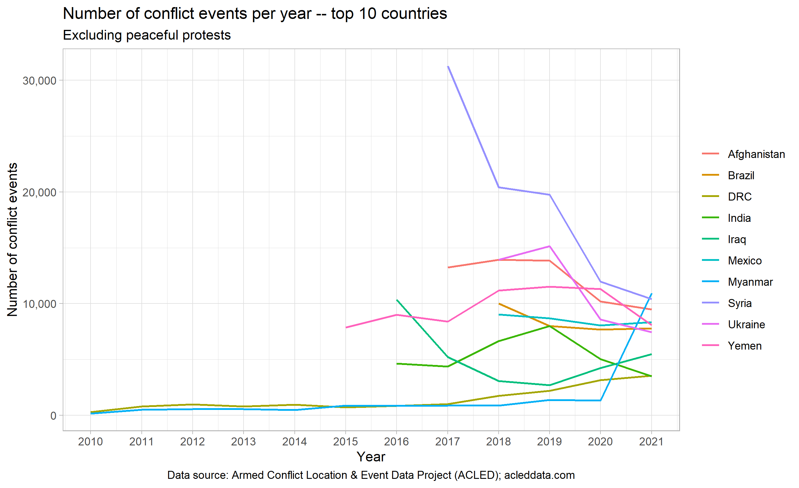
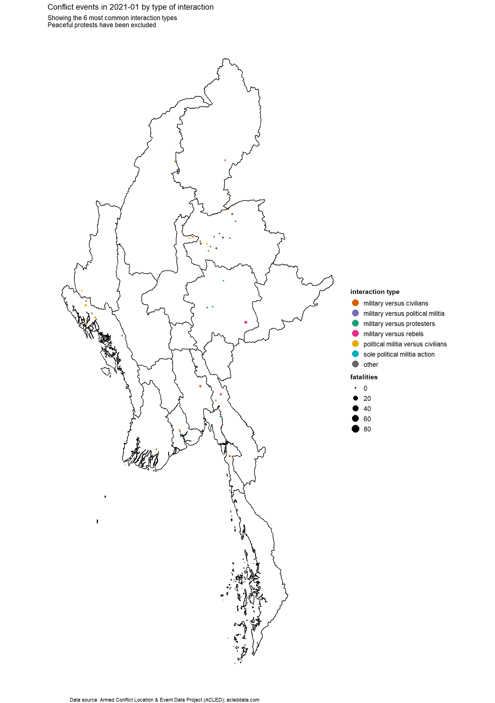
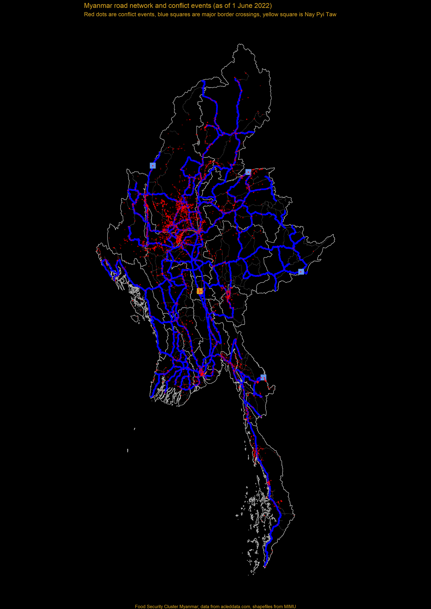
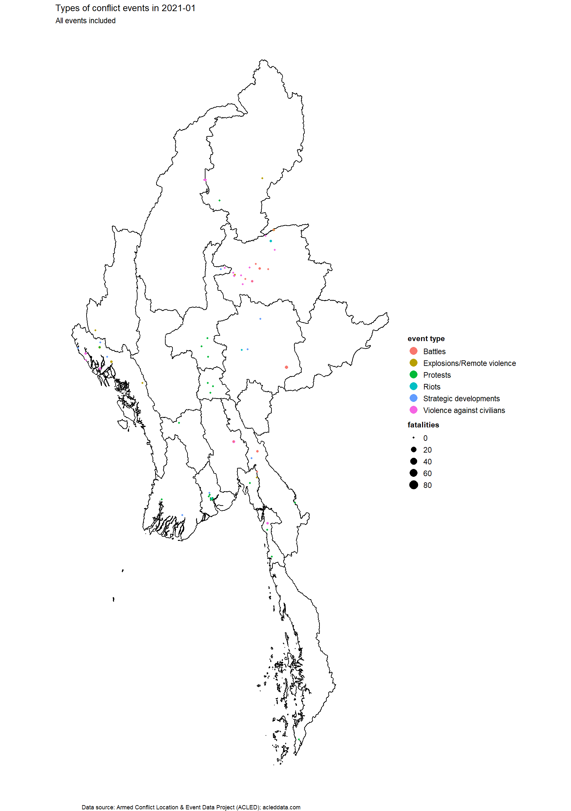
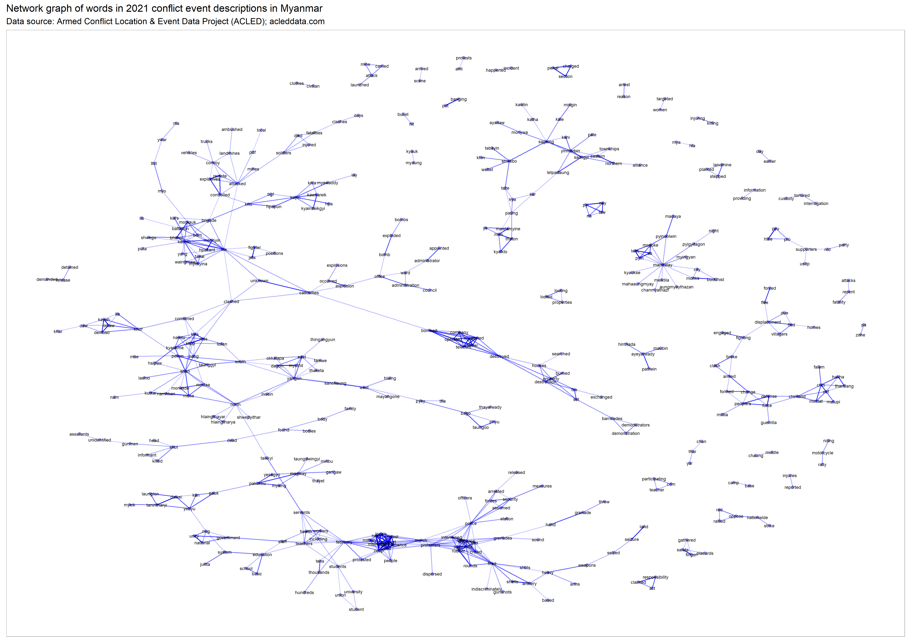

```{css, echo=FALSE}

#TOC::before {
  content: "";
  display: block;
  height: 70px;
  margin: 2em 20px 40px 20px;
  background-image: url("Myanmar_cluster_blue.png");
  background-size: contain;
  background-position: center center;
  background-repeat: no-repeat;
}
```

```{=html}
<style>
    body .main-container {
        max-width: 1280px;
    }
</style>
```

```{r setup, include=FALSE}
knitr::opts_chunk$set(echo = FALSE, fig.width=9, message = FALSE, warning=FALSE)
library(tidyverse)
library(readxl)
library(lubridate)
library(stringi)
library(pander)
library(janitor)
library(fuzzyjoin)
library(scales)
library(magrittr)
library(sf)
library(bookdown)
library(data.table)
library(patchwork)
library(plotly)
library(kableExtra)
library(DT)
library(viridis)
library(widyr)
library(gganimate)
library(mdepriv)
library(broom)
library(psych)
library(tidytext)
library(corrplot)
library(RColorBrewer)
library(treemapify)
library(tidylo)

theme_set(theme_light())

# disabling scientific notation
options(scipen = 999)

# pander tables all in one row
panderOptions('table.split.table', Inf)

# pander thousands separator
panderOptions("big.mark", ",")

# replace 
opts <- options(knitr.kable.NA = "")

`%out%` <- Negate(`%in%`)

# function for transposing df
transpose_df <- function(df) {
  t_df <- data.table::transpose(df)
  colnames(t_df) <- rownames(df)
  rownames(t_df) <- colnames(df)
  t_df <- t_df %>%
    tibble::rownames_to_column(.data = .) %>%
    tibble::as_tibble(.)
  return(t_df)
}

# function beneficiary summaries
sum_ben <- function(df, column_var){
  
  column_var <- enquo(column_var)
  
  df %>%
    group_by(!!column_var) %>% # must add bang-bang
    summarise(beneficiaries = sum(beneficiaries)) %>% 
    arrange(desc(beneficiaries))
    
}

# function beneficiary summaries, 2 grouped variables
sum_ben2 <- function(df, column_var1, column_var2){
  
  column_var1 <- enquo(column_var1)
  column_var2 <- enquo(column_var2)
  
  df %>%
    group_by(!!column_var1, !!column_var2) %>% # must add bang-bang
    summarise(beneficiaries = sum(beneficiaries)) %>% 
    arrange(desc(beneficiaries))
    
}

# cumualtive count
cumcount <- function(x){
  cumcount <- numeric(length(x))
  names(cumcount) <- x

  for(i in 1:length(x)){
    cumcount[i] <- sum(x[1:i]==x[i])
  }

  return(cumcount)
}

```


```{r table-acronyms, echo = FALSE, message=FALSE, warning=FALSE}
tribble(
  ~acronym, ~name, 
  "ACLED", "Armed Conflict Location and Event Data Project",
  "CCCM", "Camp Management and Camp Coordination",
  "CSO", "Civil Society Organization",
  "FAO", "Food and Agriculture Organization",
  "FSC", "Food Security Cluster",
  "HARP", "Humanitarian Assistance and Resilience Programme (DfID)",
  "HNO", "Humanitarian Needs Overview",
  "HRP", "Humanitarian Response Plan",
  "IDP", "Internally Displaced Person", 
  "IERP", "Interim Emergency Response Plan",
  "IFPRI", "International Food Policy Research Institute",
  "MIMU", "Myanmar Information Management Unit",
  "NNGO", "National Non-governmental Organization", 
  "OCHA", "UN Office for the Coordination of Humanitarian Affairs",
  "UXO", "Unexploded Ordnance",
  "WFP", "World Food Programme"
) %>% 
  kable(caption = "**Acronyms**", col.names = NULL) %>% 
  kable_classic_2(position = "left", full_width = FALSE)
```

<br>

## Introduction

In 2021, Myanmar experienced more conflict events than any other country.

Despite existing in a state of civil war for the past 70 years, conflict in Myanmar had remained at a relatively low level when compared with the other high conflict countries, such as Syria, Yemen and Afghanistan.

However, following the military takeover on 1 February 2021, conflict in Myanmar quickly increased, and by the end of the year it had overtaken Syria as the most conflict-affected country.

While the Russia-Ukraine war in 2022 might shift Myanmar from being the most conflict-affected country, it is likely to remain a conflict hotspot. As such, a deeper exploration of conflict in Myanmar is warranted, especially as it relates to food security and food security programming.

The following report uses data from the Armed Conflict Location and Event Data Project, or ACLED, to analyse and provide an overview of the conflict situation in Myanmar and what that means for food security into the future.

<br>



<br><br>

### About the data

```{r datasets}
# datasets 

townships <- read_csv("./data/townships.csv")
acled <- read_csv("./data/acled_20220125.csv")
actors <- read_csv("./data/actors.csv") 
acled_words <- read_csv("./data/acled_words.csv")
vulmmr <- read_csv("./data/vulmmr.csv")
fsc <- read_csv("./data/fsc5w_2021.csv")
acled_new <- read_csv("./data/acled_20220606.csv")

# shapefiles
pcode3_shape <- 
  st_read("./mmr_polbnda_adm3_mimu_250k/mmr_polbnda_adm3_mimu_250k.shp", quiet = TRUE) %>%
  rename(state = ST, 
        admin1_pcode = ST_PCODE,
        township = TS,
        admin3_pcode = TS_PCODE) %>% 
 mutate(admin3_pcode = ifelse(str_detect(township, "Hlaingtharya"), "MMR013008", admin3_pcode))

pcode1_shape <- 
  st_read("./mmr_polbnda2_adm1_mimu_250k/mmr_polbnda2_adm1_mimu_250k.shp", quiet = TRUE) %>%
  rename(state = ST, 
        admin1_pcode = ST_PCODE) %>% st_as_sf()

```

The Armed Conflict Location and Event Data Project, or ACLED, captures real-time data on the locations, dates, actors, fatalities, and types of all reported political violence and protest events around the world. As of early 2022, ACLED has recorded a total of more than 1.3 million individual events globally.

ACLED has been collecting data in Myanmar since 2010. Data is updated monthly, and is collected through a review of English and Myanmar sources to code political violence and demonstration events. The majority of the information, about 85 percent, comes from subnational, national and international media sources. The remainder comes from ACLED’s partner, the Myanmar Peace Monitor, and reports from UN agencies, international monitoring groups, and local human rights organizations. 

With some exceptions, this report uses 2021 data. The data is presented using terms consistent with the ACLED codebook, the foremost resource on their methodology and a useful reference for those seeking to understand more. 
 
The excellent scholarship of the Armed Conflict Location and Event Data Project, and their dedication to making a wealth of conflict data available for free to the public must be commended. Their calls for increased protections for journalists and independent reporting should also be supported.


<br>

### References for this report
* ACLED, (2019). Armed Conflict Location & Event Data Project (ACLED) Codebook. https://www.acleddata.com/wp-content/uploads/dlm_uploads/2017/10/ACLED_Codebook_2019FINAL_pbl.pdf.
* ACLED, (2022). ACLED data for Myanmar (2010-2022). https://acleddata.com.
* ACLED, (2020). ACLED Methodology and Coding Decisions around Political Violence in Myanmar. https://acleddata.com/acleddatanew/wp-content/uploads/2021/11/ACLED_Political-Violence-in-Myanmar_February-2020.pdf.
* Atillio Benini, Aldo Benini (2021). mdepriv: Synthetic scores of multiple deprivation. R package version 0.0.3.  https://github.com/a-benini/mdepriv/.
* Food Security Cluster, Myanmar (2021). 5Ws reporting tool.
* HARP-F and MIMU (2018). Vulnerability in Myanmar: A Secondary Data Review of Needs, Coverage and Gaps. http://themimu.info/vulnerability-in-myanmar.
* IFPRI (2022). Agricultural value chains in a fragile state: the case of rice in Myanmar. https://www.ifpri.org/publication/agricultural-value-chains-fragile-state-case-rice-myanmar.
* Silge J, Robinson D (2016). tidytext: Text Mining and Analysis Using Tidy Data Principles in R. JOSS, 1(3). doi: 10.21105/joss.00037, http://dx.doi.org/10.21105/joss.00037.
<br><br><br>


## 1. Progression of conflict events in Myanmar in 2021, by interaction type

Myanmar experienced 16,263 separate conflict events in 2021, which led to 11,506 fatalities. Conflict fatalities in 2021 were more than for the previous 10 years combined.

Most conflicts in Myanmar are interactions between two groups of actors, and most of these interactions involve the Myanmar Military as one of those actors.

The map below shows the progress in of six most common conflict interaction types by **month**. Of these, four involve the Military.

The most fatal interactions in Myanmar in 2021 were those between the Military and political militia groups. Such interactions accounted for 57% of the 11,506 conflict fatalities. In comparison, interactions between the military and rebel groups accounted for 19 percent of fatalities, military versus civilian interactions for 9 percent, and political militia versus civilians for 8 percent.

The map below plots where conflict events took place across the country, by interaction type, with the size of the points indicating the number of fatalities per event.


<br>



<br><br><br>


## 2. Food security partners and road network in relation to conflict events 

In general, food security partners are not operating in the parts of Myanmar most affected by conflict in 2021. This is evident from the map below which plots Food Security Partners working across Myanmar against 2021 conflict events.

This lack of partners in conflict areas is especially true around Sagaing and Magway. Sagaing region experienced the most conflict in 2021, followed by Magway and Chin.

Humanitarian partners have traditionally focused on Rakhine, Kachin and northern Shan – the areas which had experienced more conflict in the past. However, a shift in the conflict dynamics in Myanmar has not yet led to a reallocation of resources to target new populations most affected by conflict. The allocation of funds away from Sagaing and Magway may also be a result of OCHA’s decision to focus on peri-urban areas under the Interim Emergency Response Plan for Myanmar which was released in June of 2021.

The distribution of Food Security Cluster partners in correlation to conflict areas is discussed in more detail in Section 6.
 

<br>

```{r map-events-fsc-parnters, fig.height=12}
acled %>% 
  filter(year == 2021 & sub_event_type != "Peaceful protest") %>%
  full_join(fsc %>%
              group_by(admin3_pcode) %>% 
              summarise(partners = n_distinct(org_code)), by = "admin3_pcode") %>% 
  left_join(townships %>%  
              select(admin1_pcode, admin3_pcode), by = "admin3_pcode") %>% 
  right_join(pcode3_shape, by = "admin3_pcode") %>% 
  st_as_sf() %>% 
  ggplot() +
  geom_sf(aes(fill = partners), size = 0.1) + 
  geom_point(aes(x = longitude, y = latitude), size = 0.5, alpha = 0.4, colour = "red") +
  geom_sf(data = pcode1_shape, alpha = 0, colour = "black", size = 0.5) +
  scale_fill_viridis_c(option = "mako", direction = -1, breaks = c(1, 3, 6, 9, 12)) + 
  theme_void() +
  labs(title = "Distribution of food security partners and conflict events in 2021",
       subtitle =  "Red dots are conflict events; peaceful protests have been excluded",
       caption = "Data sources: ACLED; acleddata.com and Food Security Cluster Myanmar",
       fill = "number of\npartners") + 
  theme(plot.caption = element_text(hjust = 0.5))

# ggsave(filename = "./partners_conflict_map.png", dpi = 300, height = 12, width = 7, units = "in")
```
 
 <br>
 
Many of the literal choke points in this conflict are related to the road network. The map below shows conflict events as points in red and major roads in blue. The yellow square is Nay Pyi Taw and the light blue squares are Tamu in Sagaing and Muse and Tachileik in Shan. 

The main front (where Sagaing, Mandalay, Magway and Chin border each other) seems to be preventing the Tatamdaw from accessing the border crossing at Tamu and penetrating deeper into Sagaing. The border crossing at Muse is still very much contested. However, what is clear is that much of the armed resistance is aimed at preventing the Tatmadaw (projecting forward out of Nay Pyi Taw), from accessing the north of the country. 

It remains to be seen whether non-state armed groups will be able to close off Kachin and Shan to the Tatmadaw and pushing the front closer to Nay Pyi Taw.  

In the southeast, armed resistance seems to be aimed at preventing the Tatmadaw from reaching beyond major roads into NSAG territory which runs along the border with Thailand. However, the Tatmadaw is still able to move troops all the way down through Tanintharyi. 

<br>
 
 
 
 <br><br><br>


## 3. Progression and distribution of conflict events and fatalities

### 3.1 Conflict in Myanmar over time

Myanmar experienced a massive spike in conflict events in 2021.  This sudden increase came despite the fact that Myanmar has been embroiled in a 70-year-long civil war. 

In 2021, there were 16,263 conflict events in Myanmar, while in 2020 there were just 1,480. In the preceding decade, 2019 had accounted for the most conflict events, however there were only 1,811 in that year. In just two years, conflict in Myanmar increased almost tenfold.

<br>

```{r barplot-year-events}
acled %>% 
  filter(!is.na(event_type) & year < 2022) %>%
  mutate(year = round(year)) %>% 
  group_by(year, event_type) %>%
  summarise(count = n(), .groups = "drop") %>%
  ggplot(aes(year, count, fill = event_type, group = event_type)) + 
  # geom_line(size = 1) + 
  geom_col() +
  geom_text(aes(label = comma(stat(y), accuracy = 1), 
                group = year), 
            stat = "summary", 
            fun = sum, 
            vjust = -0.7, 
            size = 3) +
  scale_x_continuous(breaks = seq(2010, 2021, by = 1)) + 
  scale_y_continuous(labels = comma, limits = c(0, 17000)) +
  theme(axis.text.x = element_text(size = 9), 
        axis.text.y = element_text(size = 9), 
        legend.text = element_text(size = 5),
        legend.title = element_text(size = 6),
        plot.caption = element_text(hjust = 0.5)) +
  labs(x = "", 
       y = "Number of events",
       title = "Conflict events by event type, 2010-2021", 
       caption = "Data source: Armed Conflict Location & Event Data Project (ACLED); acleddata.com")

```

<br>


The breakdown of conflict events in 2021 was:

```{r conflict-events-summary-2021}
acled %>%  
  filter(year == 2021) %>% 
  group_by(event_type) %>% 
  summarise(Count = n()) %>% 
  mutate(Percentage = round(Count / sum(Count) * 100, digits = 2)) %>% 
  rename(`Event type` = event_type) %>% 
  arrange(desc(Percentage)) %>% 
  kable(caption = "2021 event types by percentage of total", 
        format.args = list(big.mark = ",")) %>% 
  kable_classic_2("striped", full_width = FALSE, position = "left") %>%  
  footnote(general = "Data source: Armed Conflict Location & Event Data Project (ACLED); acleddata.com", general_title = "")
```

<br><br>

### 3.2 Conflict-related fatalities in 2021

Myanmar experienced  more conflict fatalities in 2021 than in the preceding decade. In 2021 there were 11,506 conflict-related deaths. Between 2010 and 2020 the combined number of deaths was 9,404.

Violence against civilians accounted for 1,891 deaths. This was more than the total number of fatalities across all conflict events in 2019. Until last year, 2019 had been the deadliest conflict year in Myanmar in the past decade.

However, any reaction to this significant increase appears limited. Yet, if a single event such as a cyclone had increased annual fatalities by more than 1000%, one might expect an urgent response and a drastic reallocation of resources.


<br>

```{r barplot-year-fatalties}
acled %>% 
  filter(!is.na(event_type) & year < 2022) %>%
  mutate(year = round(year)) %>% 
  group_by(year, event_type) %>%
  summarise(fatalities = sum(fatalities), .groups = "drop") %>%
  ggplot(aes(year, fatalities, fill = event_type, group = event_type)) + 
  # geom_line(size = 1) + 
  geom_col() +
  geom_text(aes(label = comma(stat(y), accuracy = 1), group = year), 
            stat = "summary", fun = sum, vjust = -0.7, size = 3) +
  scale_x_continuous(breaks = seq(2010, 2021, by = 1)) + 
  scale_y_continuous(labels = comma, limits = c(0, 12500)) +
  theme(axis.text.x = element_text(size = 9), 
        axis.text.y = element_text(size = 9), 
        legend.text = element_text(size = 5),
        legend.title = element_text(size = 6),
        plot.caption = element_text(hjust = 0.5)) +
  labs(x = "", 
       y = "Number of conflict-related fatalities",
       title = "Fatalities by conflict event type, 2010-2021", 
       caption = "Data source: Armed Conflict Location & Event Data Project (ACLED); acleddata.com")


```


<br><br>

### 3.3 Progression of conflict events in 2021

The Military takeover on 1 February led to a steady rise in battles, explosions and remote violence, and strategic developments, through to May 2021. 

The incidence of these events declined briefly between June and August, before rising again in September 2021.

Protests and riots peaked in March 2021, immediately after the takeover. Events involving violence against civilians grew in frequency throughout the year, though a slight decline in intensity was noted at the end of the 2021.
 

<br>

```{r facet-line-plot-monthly}
acled %>%  
  filter(year == 2021) %>% 
  group_by(month, event_type) %>% 
  summarise(count = n()) %>%
 #  mutate(month = fct_rev(month)) %>% 
  ggplot(aes(x = month, 
             y = count, 
             group = event_type, 
             colour = event_type)) + 
  geom_line(size = 1) +
  facet_wrap(~event_type, scales = "free_y") + 
  labs(x = "",
       y = "Number of events", 
       title = "Number of 2021 conflict events per month, by type",
       subtitle = "Data source: Armed Conflict Location & Event Data Project (ACLED); acleddata.com") + 
  theme(legend.position = "none",
        axis.text.x = element_text(size = 5))

# cumulative counts results in a less interesting graph 
# acled %>%  
#   filter(year == 2021) %>% 
#   mutate(month = lubridate::month(event_date, label = TRUE)) %>%
#   group_by(month, event_type) %>% 
#   summarise(count = n()) %>% 
#   ungroup() %>% 
#   group_by(event_type) %>% 
#   mutate(cum_count = cumsum(count)) %>% 
#   ggplot(aes(x = month, y = cum_count, group = event_type, colour = event_type)) + 
#   geom_smooth(se = FALSE) +
#   facet_wrap(~event_type, scales = "free_y") + 
#   labs(x = "",
#        y = "Number of events", 
#        title = "Progression of 2021 conflict events, by type",
#        subtitle = "Data source: Armed Conflict Location & Event Data Project (ACLED); acleddata.com") + 
#   theme(legend.position = "none")
```

<br>

It is not clear what caused a drop in the number of conflict events in June, July and August, though one hypothesis is that heavy fighting in May led to a lull in activity as actors spent time regrouping and rethinking their strategies. A possible example of this is the formation of  the People’s Defence Force in May 2021. 

A spike in arrests during May might have also contributed, with mass arrests diminishing the capacity of certain actors to engage in conflict. The dip in conflict also coincides with the paddy sowing period. 

The table below provides a more detailed snapshot of conflicts, broken down by sub-events. Most violence against civilians was through the sub-event type labelled *Attack*. 
 

<br>

```{r line-plot-sub-event-type-2021, fig.height=6}

acled_new %>%
  filter(year >= 2021) %>% 
  mutate(sub_event_type = fct_lump(sub_event_type, 9)) %>%
  mutate(month = floor_date(event_date, "month")) %>% 
  mutate(month = 
           map(month, 
               ~ seq.Date(as.Date(.), as.Date("2022/05/01"), 
                          by = "month"))) %>% 
  unnest(month) %>% 
  group_by(month, sub_event_type) %>%
  summarise(events = n(), .groups = "drop") %>% 
  ggplot(aes(x = month, y = events, fill = sub_event_type, group = sub_event_type)) + 
  geom_area()  +
  scale_x_date(date_breaks = "1 month", labels = date_format(format = "%Y-%b")) +
  scale_y_continuous(labels = comma, breaks = seq(0, 22000, by = 2000)) + 
  theme(legend.position = "top", 
        axis.text.x = element_text(angle = 30, hjust = 1, vjust = 1)) +
  labs(x = "",
       y = "Cumulative conflict events", 
       title = "Cumulative 2021-2022 conflict events per month, by event type",
       subtitle = "Data source: Armed Conflict Location & Event Data Project (ACLED); acleddata.com", 
       fill = "")
  


```


<br><br>

### 3.4 Contributors to conflict fatalities

Battles and explosions and remote violence were the largest contributors to conflict fatalities in 2021. 

<br>

```{r line-plot-fatalities, fig.height=6}
 
acled_new %>%
  filter(year >= 2021) %>% 
  mutate(month = floor_date(event_date, "month")) %>% 
  mutate(month = map(month, ~ seq.Date(as.Date(.), as.Date("2022/05/01"), by = "month"))) %>% 
  unnest(month) %>% 
  group_by(month, event_type) %>%
  summarise(fatalities = sum(fatalities), .groups = "drop") %>% 
  ggplot(aes(x = month, y = fatalities, group = event_type, fill = event_type)) + 
  geom_area() +
  scale_x_date(date_breaks = "1 month", labels = date_format(format = "%Y-%b")) +
  scale_y_continuous(breaks = seq(0, 22000, by = 2000), labels = comma) +
  theme(legend.position = "top", 
        axis.text.x = element_text(angle = 30, hjust = 1, vjust = 1)) +
  labs(x = "",
       y = "Cumulative fatalities", 
       title = "Cumulative 2021-2022 conflict-related fatalities per month, by event type",
       subtitle = "Data source: Armed Conflict Location & Event Data Project (ACLED); acleddata.com", 
       fill = "")


```

<br>

Of concern, violence against civilians accounted for 15% of all conflict fatalities.

```{r fatalities-summary-2021}
acled_new %>%
  filter(year >= 2021) %>% 
  group_by(event_type) %>% 
  summarise(fatalities = sum(fatalities)) %>% 
  mutate(percentage = round(fatalities / sum(fatalities) * 100, digits = 2)) %>% 
  rename(`Event type` = event_type,
         Fatalities = fatalities, 
         Percentage = percentage) %>% 
  arrange(desc(Percentage)) %>% 
  kable(caption = "2021-2022 conflict fatalities by event type", format.args = list(big.mark = ",")) %>% 
  kable_classic_2("striped", full_width = FALSE, position = "left") %>%  
  footnote(general = "Data source: Armed Conflict Location & Event Data Project (ACLED); acleddata.com", general_title = "")
```

<br>

However, the event type *Violence against civilians* does not encompass all fatal incidents involving non-combatants. If the data is examined through the lens of interaction type, which records the types of actors involved in each conflict event, it shows that `r round((filter(acled, year == 2021 & str_detect(inter_type, "civilian|protester")) %>% {sum(.$fatalities)}) / (filter(acled, year == 2021) %>% {sum(.$fatalities)}) * 100, digits = 2)` percent of fatalities stem from interactions involving non-combatants, that is civilians and protesters. The next chapter deals with a more detailed assessment of the number of fatalities related to non-combatants.

<br>

```{r line-plot-inter-type-2021, fig.height=6}


acled_new %>%
  filter(inter_type != "sole protester action") %>% 
  mutate(inter_type = fct_lump(inter_type, 6)) %>% 
  filter(year >= 2021) %>% 
  mutate(month = floor_date(event_date, "month")) %>% 
  mutate(month = map(month, ~ seq.Date(as.Date(.), as.Date("2022/05/01"), by = "month"))) %>% 
  unnest(month) %>% 
  group_by(month, inter_type) %>% 
  summarise(fatalities = sum(fatalities)) %>% 
  ggplot(aes(x = month, y = fatalities, group = inter_type, fill = inter_type)) + 
  geom_area() +
  scale_x_date(date_breaks = "1 month", labels = date_format(format = "%Y-%b")) +
  scale_y_continuous(breaks = seq(0, 22000, by = 2000), labels = comma) +
  theme(legend.position = "top", 
        axis.text.x = element_text(angle = 30, hjust = 1, vjust = 1)) +
  scale_fill_manual(values = c("#D95F02", "#7570B3", "#1B9E77", "#E7298A", "#66A61E", "#E6AB02", "#666666", "#A6761D")) +
  theme(legend.position = "top") +
  labs(x = "Month", 
       y = "Cumulative fatalities", 
       title = "Cumulative fatalities in 2021-2022 by interaction type, excluding sole protester action",
       subtitle = "Data source: Armed Conflict Location & Event Data Project (ACLED); acleddata.com", 
       fill = "")   

```

<br>

The largest number of fatalities are related to events involving the military, political militias, including the People’s Defense Force, as well as those involving rebel groups. 

```{r fatalities-summary-2021-inter-type}
acled %>%  
  filter(year == 2021) %>%
  filter(inter_type != "sole protester action") %>% 
  mutate(inter_type = fct_lump(inter_type, 6), 
         inter_type = str_to_title(inter_type), 
         inter_type = str_replace_all(inter_type, "Versus", "versus")) %>% 
  group_by(inter_type) %>% 
  summarise(fatalities = sum(fatalities)) %>% 
  mutate(percentage = round(fatalities / sum(fatalities) * 100, digits = 2)) %>% 
  rename(Fatalities = fatalities, 
         Percentage = percentage,
         `Interaction type` = inter_type) %>% 
  arrange(desc(Percentage)) %>% 
  kable(caption = "2021 conflict fatalities by interaction type", format.args = list(big.mark = ",")) %>% 
  kable_classic_2("striped", full_width = FALSE, position = "left") %>%  
  footnote(general = "Data source: Armed Conflict Location & Event Data Project (ACLED); acleddata.com", general_title = "")


```


<br><br>

### 3.5 Geographic distribution of conflict events in 2021

<br> 

```{r state-events-plot}

acled %>% 
  filter(year == 2021) %>% 
  group_by(admin1, event_type) %>% 
  summarise(count = n()) %>% 
  mutate(sum = sum(count)) %>% 
  ungroup() %>% 
  mutate(admin1 = fct_reorder(admin1, sum, .desc = TRUE)) %>% 
  ggplot(aes(x = admin1, y = count, fill = event_type)) + 
  geom_col() +
  geom_text(aes(label = comma(stat(y), accuracy = 1), group = admin1), stat = "summary", fun = sum, vjust = -0.5, size = 3) +
  scale_y_continuous(labels = comma, breaks = seq(0, 3800, by = 1000)) +
  theme(axis.text.x = element_text(size = 7, hjust = 1, angle = 60), 
        axis.text.y = element_text(size = 9), 
        legend.text = element_text(size = 5),
        legend.title = element_text(size = 6),
        plot.caption = element_text(hjust = 0.5)) +
  labs(x = "", 
       y = "Number of conflict events",
       title = "2021 conflict events by state/region", 
       caption = "Data source: Armed Conflict Location & Event Data Project (ACLED); acleddata.com")

  
```

<br>

Sagaing experienced the highest number of conflict events and fatalities in 2021. Indeed, Sagaing region experienced more than three times the number of conflict-related fatalities than Magway, the next most-affected area. This represents a significant shift in the pattern of conflict in Myanmar, which has traditionally revolved around Kachin, Rakhine and Shan.

<br>

```{r state-fatalities-plot}

acled %>% 
  filter(year == 2021) %>% 
  group_by(admin1, event_type) %>% 
  summarise(fatalities = sum(fatalities)) %>% 
  mutate(sum = sum(fatalities)) %>% 
  ungroup() %>% 
  mutate(admin1 = fct_reorder(admin1, sum, .desc = TRUE)) %>% 
  ggplot(aes(x = admin1, y = fatalities, fill = event_type)) + 
  geom_col() +
  geom_text(aes(label = comma(stat(y), accuracy = 1), group = admin1), stat = "summary", fun = sum, vjust = -0.5, size = 3) +
  scale_y_continuous(labels = comma, breaks = seq(0, 5000, by = 1000)) +
  theme(axis.text.x = element_text(size = 7, hjust = 1, angle = 60), 
        axis.text.y = element_text(size = 9), 
        legend.text = element_text(size = 5),
        legend.title = element_text(size = 6),
        plot.caption = element_text(hjust = 0.5)) +
  labs(x = "", 
       y = "Number of fatalities",
       title = "2021 conflict-related fatalities by state/region", 
       caption = "Data source: Armed Conflict Location & Event Data Project (ACLED); acleddata.com")
 
```

<br><br>

### 3.6 Progression of the conflict in 2021 by event type

The map below shows 2021 conflict events by **month**. The color of each point indicates the type of conflict event. The number of fatalities associated with each event is indicated by the size of each point. It is interesting to note that after the protests in February and March 2021, the conflict moves on to a new stage in April and May, visibly increasing in intensity.

<br>


<br><br><br>

## 4. Conflict and non-combatants 

### 4.1 Conflict events involving non-combatants

<br>

Non-combatants were involved in almost one third of conflict-related fatalities in Myanmar in 2021. In total, there were `r filter(acled, year == 2021) %>% {sum(.$fatalities)} %>% format(big.mark = ",")` fatalities, of which `r round(filter(acled, year == 2021 & non_combatant == TRUE) %>% {sum(.$fatalities)}) %>% format(big.mark = ",")` were related to non-combatants. 

The map below shows conflict events labelled by ACLED as *Violence against civilians* and where the event was described as involving a civilian, protester, or villager.

However, protest events have been filtered out as these are generally one-sided, where the only actors involved are protesters and they do not result in property damage or death. 

Events involving non-combatants are plotted on the map below, with those events that resulted in fatalities shown in red.
 
<br>

```{r map-non-combatants, fig.height=10}
acled %>% 
  filter(year == 2021 & sub_event_type != "Peaceful protest") %>% 
  filter(non_combatant == TRUE) %>% 
  right_join(pcode3_shape, by = "admin3_pcode") %>% 
  filter(!is.na(has_fatalities)) %>% 
  st_as_sf() %>% 
  ggplot() +
  geom_sf(size = 0.1, alpha = 0, data = pcode3_shape) + 
  geom_point(aes(x = longitude, y = latitude, size = fatalities, colour = has_fatalities), alpha = 0.6) +
  geom_sf(data = pcode1_shape, alpha = 0, colour = "black", size = 0.5) +
  scale_colour_manual(values = c("blue", "red")) +
  theme_void() +
  scale_size_continuous(range = c(0.5, 4)) +
  labs(title = "Distribution of 2021 conflict events involving non-combatants",
       subtitle =  "Civilians and protesters are considered non-combatants",
       caption = "Data sources: Armed Conflict Location & Event Data Project (ACLED); acleddata.com and Food Security Cluster Myanmar",
       fill = "number of\npartners") + 
  theme(plot.caption = element_text(hjust = 0.5)) + 
  guides(colour = guide_legend(reverse = TRUE,
                               override.aes = list(alpha=1)))
```

<br>

A breakdown of sub conflict events involving non-combatants is listed below. 


```{r table-sub-event-non-combatants}
acled %>% 
  filter(year == 2021 & sub_event_type != "Peaceful protest") %>% 
  filter(non_combatant == TRUE) %>% 
  group_by(sub_event_type) %>% 
  summarise(events = n(), 
            fatalities = sum(fatalities)) %>% 
  mutate(sort = events / sum(events) + fatalities / sum(fatalities)) %>% 
  mutate(sub_event_type = ifelse(sort < 0.017, "Other", sub_event_type)) %>% 
  group_by(sub_event_type) %>% 
  summarise(events = sum(events), 
            fatalities = sum(fatalities)) %>% 
  rename(`Sub-event type` = sub_event_type, 
         Events = events, 
         Fatalities = fatalities) %>% 
  kable(caption = "Top 10 sub-event types involving non-combatants in 2021", format.args = list(big.mark = ",")) %>% 
  kable_classic_2("striped", position = "left", full_width = FALSE) %>% 
  footnote(general = "Data source: Armed Conflict Location & Event Data Project (ACLED); acleddata.com", 
           general_title = "")
```

<br><br>

### 4.2 Events and fatalities involving non-combatants, by state

Most of the fatal conflict events in Myanmar in 2021 occurred in Sagaing region. In total, the region recorded 1,178 conflict-related fatalities, significantly more than in Mandalay and Yangon, the next most fatal regions. In Mandalay, there were 411 conflict-related deaths and in Yangon there were 300.

```{r barplot-events-fatalities-sr}
acled %>% 
  filter(year == 2021 & sub_event_type != "Peaceful protest") %>% 
  filter(non_combatant == TRUE) %>%
  group_by(admin1) %>% 
  summarise(events = n(), 
            fatalities = sum(fatalities)) %>%
  mutate(admin1 = fct_reorder(admin1, -fatalities)) %>% 
  pivot_longer(cols = c(fatalities, events), names_to = "type", values_to = "value") %>% 
  mutate(type = fct_relevel(type, c("fatalities", "events"))) %>% 
  ggplot(aes(x = admin1, y = value, fill = type)) + 
  geom_col(position = "dodge") +
  geom_text(aes(label = value), size = 2.5, position = position_dodge(width = 0.9), vjust = -0.3) +
  theme(axis.text.x = element_text(angle = 40, vjust = 0.6), 
        legend.text = element_text(size = 7)) +
  labs(x = "", 
       y = "Number of fatalities / events",
       title = "2021 conflict events and fatalities involving non-combatants by state (excl. peaceful protests)",
       subtitle = "Data sources: Armed Conflict Location & Event Data Project (ACLED); acleddata.com", 
       fill = "")

```
<br>

The chart above shows events and fatalities involving non-combatants, broken down by state and region. 

The large number of fatalities in Sagaing, Mandalay and Yangon are due to a high rate of arrests and attacks on civilians, as shown below. However, the ratio of attacks to arrests is significantly higher in Sagaing than compared to Mandalay and Yangon.


```{r table-sub-events-sr}
acled %>% 
  filter(year == 2021 & sub_event_type != "Peaceful protest") %>% 
  filter(non_combatant == TRUE) %>%
  mutate(sub_event_type = fct_lump(sub_event_type, 5)) %>% 
  group_by(admin1, sub_event_type) %>%
  summarise(events = n(),
            Fatalities = sum(fatalities)) %>% 
  pivot_wider(names_from = sub_event_type, values_from = events) %>% 
  group_by(admin1) %>% 
  summarise(across(where(is.numeric), ~ sum(.x, na.rm = TRUE))) %>%
  mutate(admin1 = recode(admin1, "Nay Pyi Taw" = "Naypyitaw")) %>%
  rename(state = admin1) %>% 
  arrange(desc(Fatalities)) %>% 
  relocate(Fatalities, .after = Other) %>%
  rename(State = state) %>% 
  kable(caption = "Main sub-event types and fatalities involving non-combatants by state/region", 
        format.args = list(big.mark = ",")) %>% 
  kable_classic_2("striped") %>% 
  footnote(general = "Data sources: Armed Conflict Location & Event Data Project (ACLED); acleddata.com", 
           general_title = "")
  
  
```


<br>

Kale Township in Sagaing experienced the highest rate of fatalities involving non-combatants in 2021. In total, 7 per cent of non-combatant-related fatalities occured in Kale, which represents `r filter(acled, year == 2021 & admin3_pcode == "MMR005027" & non_combatant == TRUE) %>% {sum(.$fatalities)}` deaths. Overall, `r filter(acled, year == 2021 & fatalities > 0 & non_combatant == TRUE) %>% distinct(admin3_pcode) %>% nrow()`  townships reported fatalities involving non-combatants in 2021. Of the 20 townships with the most non-combatant fatalities, 11 were in the Sagaing Region. 

<br>

```{r map-townships-fatalities-noncombatant, fig.height=10}
acled %>% 
  filter(year == 2021) %>% 
  filter(non_combatant == TRUE) %>% 
  group_by(admin1, admin3, admin3_pcode) %>% 
  summarise(events = n(), 
            fatalities = sum(fatalities), .groups = "drop") %>% 
  mutate(pc_events = events / sum(events), 
         pc_fatalities = fatalities / sum(fatalities)) %>% 
  arrange(desc(pc_fatalities)) %>% 
  mutate(pc_fatalities = na_if(pc_fatalities, 0), 
         fatalities = na_if(fatalities, 0)) %>% 
  right_join(pcode3_shape, by = "admin3_pcode") %>% 
  st_as_sf() %>% 
  ggplot() +
  geom_sf(aes(fill = fatalities), size = 0.1) + 
  geom_sf(data = pcode1_shape, alpha = 0, colour = "black", size = 0.5) + 
  scale_fill_viridis_c(option = "magma", direction = -1) +
  theme_void() + 
  labs(title = "Fatalities involving non-combatants by township 2021",
       caption = "Data source: Armed Conflict Location & Event Data Project (ACLED); acleddata.com",
       fill = "fatalities") +
  theme(plot.caption=element_text(hjust = 0.2))


  
```


<br><br><br>

## 5. Conflict actors

### 5.1 Conflict events by type of actor 

The next two sections summarize conflict events and fatalities by event type and actor type. 

In the plot below, faceted by type of conflict actor, shows the types of conflict events each type of actor has been involved in during 2021. For instance, political militias are most heavily involved in conflict events related to explosions and remote violence, whereas rebel groups are most involved in battles. 

Because most event types, with the exception of peaceful protests, involve more than one actor, individual events appear in more than one table. For example, the same battle involving state forces and rebel groups would appear in the event count tables for each type of conflict actor. This means actual number of events is less than the total shown across all tables.
 

<br>

```{r actor-facet-event-count, fig.height = 7}

actors %>%
  mutate(event_type = fct_relevel(event_type, c("Battles", "Explosions/Remote violence", "Violence against civilians",
                                                "Protests", "Riots", "Strategic developments"))) %>% 
  mutate(inter1 = fct_relevel(inter1, c("state_forces", "protesters", "civilians", "political_militias", "rebel_groups",
                                        "rioters", "identity_militias", "external_other_force"))) %>% 
  filter(year == 2021) %>% 
  group_by(actor_simple, event_type, inter1) %>% 
  summarise(count = n(),
            fatalities = sum(fatalities)) %>% 
  group_by(event_type) %>% 
  # filter(inter1 != "identity_militias") %>% 
  ggplot(aes(x = count, y = event_type, fill = event_type)) +
  geom_col() +
  scale_x_continuous(labels = comma) +
  # scale_fill_viridis_d() +
  facet_wrap(~ inter1, scales = "free_x") + 
  theme(legend.position = "none",
        plot.caption = element_text(hjust = 0.5)) +
  labs(x = "Number of conflict events associated with each actor type", 
       y = "Type of conflict event", 
       title = "Number of conflict events associated with each actor type",
       subtitle = "Faceted by type of conflict actor",
       caption = "Data source: Armed Conflict Location & Event Data Project (ACLED); acleddata.com")


```

<br>

```{r summary-table-event_type}
actors %>% 
  mutate(inter1 = fct_relevel(inter1, c("state_forces", "protesters", "civilians", "political_militias", "rebel_groups",
                                        "rioters", "identity_militias", "external_other_force"))) %>% 
  filter(year == 2021) %>% 
  group_by(`Actor type` = inter1) %>% 
  summarise(events = n()) %>%  
  mutate(`Actor type` = str_to_title(`Actor type`)) %>% 
  transpose_df() %>% 
  row_to_names(row_number = 1) %>% 
  mutate_at(vars("Protesters", "Civilians", "State_forces", "Political_militias", "Rebel_groups",
                                        "Rioters", "Identity_militias", "External_other_force"),
            ~ as.numeric(.x)) %>% 
  kable(caption = "2021 number of conflict events by actor type", format.args = list(big.mark = ","), digits = 0) %>% 
  kable_classic_2() %>% 
  footnote(general = "Data source: Armed Conflict Location & Event Data Project (ACLED); acleddata.com",
           general_title = "")
```

<br><br>

### 5.2 Fatalities by actor type

The tables below show the number of fatalities associated with each type of actor. 

Similar to the plot above, the plot below has been faceted by actor type and shows the number of fatalities associated with a specific actor type by type of event. As these actor types are exhaustive, a specific event type can be tracked across different actors. For instance, there were 1,729 fatalities related to *Violence against civilians* (in green), using the plot below, one can see how many of these 1,729 fatalities the various actor types were associated with. Civilians were, of course, one of the parties involved in the *Violence against civilians* event type, but the other largest actors were state forces and political militias.  

It should be noted that the ACLED dataset does not have a column to assign blame. For instance, under fatalities related to protests, `r filter(actors, inter1 == "protesters") %>% {sum(.$fatalities)}` fatalities were associated with protesters, with the main other party involved almost entirely being state forces, with very small numbers being associated with rioters.

<br>

```{r actor-facet-event-fatalities, fig.height=7}

actors %>%
  mutate(event_type = fct_relevel(event_type, c("Battles", "Explosions/Remote violence", "Violence against civilians",
                                                "Protests", "Riots", "Strategic developments"))) %>% 
  mutate(inter1 = fct_relevel(inter1, c("state_forces", "protesters", "civilians", "political_militias", "rebel_groups",
                                        "rioters", "identity_militias", "external_other_force"))) %>% 
  filter(year == 2021) %>% 
  group_by(actor_simple, event_type, inter1) %>% 
  summarise(count = n(),
            fatalities = sum(fatalities)) %>% 
  group_by(event_type) %>% 
  filter(inter1 %out% c("external_other_force")) %>% 
  mutate(pc_total = count / sum(count)) %>% 
  ggplot(aes(x = fatalities, y = event_type, fill = event_type)) +
  geom_col() +
  scale_x_continuous(labels = comma) +
  # scale_fill_viridis_d() +
  facet_wrap(~ inter1, scales = "free_x") + 
  theme(legend.position = "none",
        plot.caption = element_text(hjust = 0.5)) +
  labs(x = "Number of fatalities associated with each actor type", 
       y = "Type of conflict event", 
       title = "Number of fatalities associated with each actor type",
       subtitle = "Faceted by type of conflict actor",
       caption = "Data source: Armed Conflict Location & Event Data Project (ACLED); acleddata.com")

```
<br>

```{r summary-table-fatalities}
actors %>% 
  mutate(inter1 = fct_relevel(inter1, c("state_forces", "protesters", "civilians", "political_militias", "rebel_groups",
                                        "rioters", "identity_militias", "external_other_force"))) %>% 
  filter(year == 2021) %>% 
  group_by(`Actor type` = inter1) %>% 
  summarise(Fatalities = sum(fatalities)) %>%  
  mutate(`Actor type` = str_to_title(`Actor type`)) %>% 
  transpose_df() %>% 
  row_to_names(row_number = 1) %>% 
  mutate_at(vars("Protesters", "Civilians", "State_forces", "Political_militias", "Rebel_groups",
                                        "Rioters", "Identity_militias", "External_other_force"),
            ~ as.numeric(.x)) %>% 
  kable(caption = "2021 number of fatalities associated with each actor type", format.args = list(big.mark = ","), digits = 0) %>% 
  kable_classic_2() %>% 
  footnote(general = "Data source: Armed Conflict Location & Event Data Project (ACLED); acleddata.com",
           general_title = "")
```

<br><br>


### 5.3 Actors associated with the most fatalities

Conflict events between the Myanmar Military and the People’s Defense Force accounted for the greatest number of fatalities in 2021. This is significant given that the People’s Defense Force (PDF) was only created in May of last year. In total, 3,143 fatalities resulted from conflict events involving the Military and the PDF.

Conflict between civilians and the Military was the second most-likely type of conflict event to cause fatalities. In total, 966 people died from this this type of conflict.

The list below shows the number of fatalities associated with interactions between a given pair of actors. Only the top 20 pairs, in terms of fatalities, are shown. Of concern is that civilians as actors appear in the list, both in interactions with the Military and with Unidentified Armed Groups fighting military forces.


```{r table-actor-pairs-fatalities}
actors %>% 
  filter(year == 2021) %>% 
  filter(sub_event_type != "Peaceful protest") %>% 
  pairwise_count(actor_simple, data_id, sort = TRUE, upper = FALSE, wt = fatalities) %>% 
  transmute(Actor1 = item1, 
            Actor2 = item2,
            Fatalities = n) %>% 
  head(20) %>% 
  kable(caption = "Conflict actor pairs with the highest fatalities in 2021", format.args = list(big.mark = ",")) %>% 
  kable_classic_2("striped") %>% 
  footnote("Data source: Armed Conflict Location & Event Data Project (ACLED); acleddata.com", general_title = "")
```

<br>

ACLED does not collect data on the actor responsible for a fatality. This makes it impossible to distinguish whether a fatality was caused by the other actor in a conflict, or as a result of the actions of the person that dies.
Despite this, it is interesting to see which actors are associated with the most fatalities, and may be considered the ‘bloodiest’.

The plot below shows the actors associated with the most fatalities, per event. Only actors who participated in more than 50 conflict events during 2021 are included. 

Each point shows the average number of fatalities associated with the actor for each conflict event it participated in. The whiskers show the range of fatalities across events, with at least 95 percent of all conflict events covered within the range. 

Political militias and rebel groups are associated with the highest fatality events, which is not surprising given that incidents between the People’s Defense Force and the Military resulted in the highest number of fatalities, as shown above.


<br>

```{r fatalities-actors-errorbarh, fig.height=6}
actors_conf_int <- actors %>%  
  filter(year == 2021) %>% 
  add_count(actor_simple) %>% 
  filter(n > 50) %>% 
  nest(-actor_simple) %>% 
  mutate(model = map(data, ~ t.test(.$fatalities))) %>% 
  unnest_legacy(map(model, tidy))

actors_conf_int %>%  
  left_join(actors %>% select(actor_simple, inter1) %>% distinct(), by = "actor_simple") %>% 
  mutate(inter1 = fct_relevel(inter1, c("protesters", "civilians", "state_forces", "political_militias", "rebel_groups",
                                        "rioters", "identity_militias", "external_other_force"))) %>% 
  mutate(actor_simple = str_remove(actor_simple, "\\:.*"),
         actor_simple = fct_reorder(actor_simple, estimate)) %>% 
  ggplot(aes(x = estimate, y = actor_simple, colour = inter1)) + 
  geom_point(size = 2) + 
  geom_errorbarh(aes(xmin = conf.low, xmax = conf.high), height = 0.15) + 
  scale_colour_viridis_d(direction = -1) +
  scale_x_continuous(breaks = seq(0, 7, by = 1)) +
  # scale_colour_brewer(palette = "Dark2") + 
  labs(x = "Average number of fatalities per conflict event",
      y = "Conflict actor", 
      title = "Which conflict actors are associated with the most fatalities per event?", 
      subtitle = "Only includes actors involved in more than 50 conflict events", 
      caption = "Data source: Armed Conflict Location & Event Data Project (ACLED); acleddata.com",
      colour = "") + 
  theme(plot.caption = element_text(hjust = 0.5), 
        legend.text = element_text(size = 6), 
        legend.position = "bottom") +
  guides(colour = guide_legend(nrow = 1))

```

<br><br> 

### 5.4 Summary table of main conflict actors by actor type

```{r table-main-conflict-actors}
top_actors <- actors %>%  
  filter(year == 2021 & inter1 != "external_other_force") %>%
  group_by(inter1) %>% 
  mutate(actor_simple = fct_lump(actor_simple, prop = .02)) %>% 
  ungroup() %>% 
  count(inter1, actor_simple, sort = TRUE) %>% 
  group_by(inter1) %>% 
  mutate(`%_of_group` = round(n / sum(n) * 100, digits = 2),
         inter1 = str_to_title(inter1)) %>%
  rename(Events = n,
         `Actor type` = inter1,
         `Actor name` = actor_simple) %>% 
  # top_n(n = 5) %>% 
  arrange(`Actor type`)

kable(top_actors, caption = "Top conflict actors in 2021 by actor type", format.args = list(big.mark = ",")) %>% 
  pack_rows(index = table(top_actors$`Actor type`)) %>% 
  kable_classic_2("striped") %>%  
  footnote(general = "Data source: Armed Conflict Location & Event Data Project (ACLED); acleddata.com", 
           general_title = "")

  
```

<br><br>

### 5.5 Geographic distribution of conflict actors

Sagaing is home to a huge concentration of conflict actors, with many more than in the traditional conflict areas of Kachin, northern Shan and Rakhine.

<br>

```{r map-conflict-actors-township, fig.height=10}
actors %>% 
  filter(year == 2021) %>% 
  group_by(admin3_pcode) %>% 
  summarise(conflict_actors = n_distinct(actor_simple)) %>% 
  left_join(pcode3_shape, by = "admin3_pcode") %>% 
  st_as_sf() %>% 
  ggplot() + 
  geom_sf(aes(fill = conflict_actors), size = 0.01) +
  geom_sf(data = pcode1_shape, size = 0.5, colour = "black", alpha = 0) + 
  scale_fill_viridis_c(option = "magma", direction = -1) +
  theme_void() +
  labs(fill = "number of\n conflict actors",
       title = "Distribution of 2021 conflict actors at township level",
       caption = "Data source: Armed Conflict Location & Event Data Project (ACLED); acleddata.com")
  
```


<br><br><br>


## 6. Correlations between conflict and food security cluster footprint 


### 6.1 Correlation plot


```{r conflict-score-df, warning=FALSE}
conflict_df <- acled %>% 
  # do you really need this step since you're using Betti-Verma
  mutate(event_type = case_when(event_type == "Protests" ~ "Protests_and_Riots",
                                event_type == "Riots" ~ "Protests_and_Riots", 
                                TRUE ~ event_type)) %>% 
  filter(year == 2021 & sub_event_type != "Peaceful protest") %>%
  group_by(admin3_pcode, event_type) %>% 
  summarise(count = n(), .groups = "drop") %>%  
  pivot_wider(names_from = event_type, values_from = count) %>% 
  clean_names() %>% 
  replace_na(list(battles = 0, explosions_remote_violence = 0, violence_against_civilians = 0,
                  strategic_developments = 0, protests_and_riots = 0)) %>% 
  # mutate(total_events = rowSums(across(where(is.numeric)), na.rm = TRUE)) %>% 
  left_join(acled %>% 
              filter(year == 2021) %>% 
              group_by(admin3_pcode) %>% 
              summarise(fatalities = sum(fatalities)), by = "admin3_pcode") %>% 
  ungroup()
  
index_shares <- conflict_df %>%   
  mutate_at(vars(c(battles, explosions_remote_violence, violence_against_civilians, fatalities,
                   strategic_developments, protests_and_riots)), 
           scale) %>%  
  mutate_at(vars(c(battles, explosions_remote_violence, violence_against_civilians, fatalities,
                   strategic_developments, protests_and_riots)), 
           funs((. - min(., na.rm = T))/(max(., na.rm = T) - min(., na.rm = T)))) %>% 
  mdepriv(c("battles", "explosions_remote_violence", "violence_against_civilians", "fatalities", "strategic_developments", "protests_and_riots"),
          method = "bv", output = "all")

conflict_score <- conflict_df %>% 
  left_join(index_shares$data %>% 
              select(admin3_pcode, 
                     score_i,
                     index_battles = battles, 
                     index_explosions_remote_violence = explosions_remote_violence,
                     index_violence_against_civilians = violence_against_civilians, 
                     index_fatalities = fatalities, 
                     index_strategic_developments = strategic_developments, 
                     index_protests_and_riots = protests_and_riots), by = "admin3_pcode") %>% 
  mutate(env_battles = battles / max(battles), 
         env_explosions_remote_violence = explosions_remote_violence / max(explosions_remote_violence),
         env_violence_against_civilians = violence_against_civilians / max(violence_against_civilians), 
         env_fatalities = fatalities / max(fatalities), 
         score_env = (env_battles + env_explosions_remote_violence + env_violence_against_civilians + env_fatalities) / 4) %>% 
  left_join(acled %>% 
              distinct(admin1, admin3, admin3_pcode), by = "admin3_pcode") %>% 
  left_join(fsc %>%  
              group_by(admin3_pcode) %>% 
              summarise(partners = n_distinct(org_code),
                        beneficiaries = sum(beneficiaries[unique_beneficiaries == "Yes"])), by = "admin3_pcode")

# conflict_score %>% do.call(data.frame, .) %>% as_tibble() %>% write_csv("conflict_score.csv")
```


Food security partners are not operating in the parts of Myanmar most affected by conflict in 2021, as shown previously in Section 2. Sagaing region experienced the most conflict in 2021, followed by Kachin and northern Shan, however humanitarian partners continue to work in Rakhine, Kachin and southern Shan, with some shift towards working in peri-urban Yangon and Mandalay.

The plot below correlates conflict indicators with the number of FSC partners and beneficiaries at township level. 

The darker the color of the circle and the larger the size, is an indication of a greater the degree of correlation, with +1 being a perfect positive correlation and -1 being a perfect negative correlation. 

As may be expected, conflict indicators are highly correlated with each other. What is of concern is the very weak correlation between the presence of Food Security Cluster partners and beneficiaries in relation to the incidence of conflict.


<br>

```{r small-corrplot}

conflict_score %>% 
  select(battles, explosions_remote_violence, protests_and_riots, strategic_developments, violence_against_civilians, 
         fatalities, partners, beneficiaries) %>% 
  filter(!is.na(partners) & !is.na(beneficiaries)) %>% 
  cor(method = c("pearson")) %>% 
  corrplot(type = "upper", col = brewer.pal(n = 8, name = "RdYlBu"), tl.srt = 35, 
           title = "Correlation plot between conflict indicators and FSC presence \n",  mar=c(0,0,2,0), diag = FALSE)
  
```

<br>

The plot below uses the same variables as above, but provides additional detail and information. 

The plot is split into an upper and lower triangle, divided diagonally by the blue histograms.

The numbers in the upper triangle are the specific numeric values of the blue and yellow circles in the plot above, indicating the correlation coefficient of between +1 and –1. The asterisks denote the level of statistical significance of the correlations. 
The histograms show the distribution of each variable. For the conflict variables the bars are skewed to the left, indicating that most townships experienced relatively low levels of conflict.

This is borne out in an examination of the lower triangle, where each point is a township and the red line shows the linear fit between each pair of variables. Most townships tend to be concentrated around the bottom-left quadrant of the chart, with many outliers. The steeper the gradient of red line, the stronger the correlation.

For instance, the two variables most highly-correlated with each other are violence against civilians and strategic developments: they share a correlation coefficient of 0.79, meaning that in 79% of the townships in which violence against civilians occurred, strategic developments also took place (the most common strategic developments were arrests and property damage). This relationship is statistically significant, that is to say, it was not by chance that these two types of conflict events tended to occur in the same places.

<br>

```{r corrplot, fig.height=7.5}
conflict_score %>% 
  mutate(log_beneficiaries = log(beneficiaries)) %>% 
  select(battles, explosions_remote_violence, violence_against_civilians, protests_and_riots, strategic_developments, 
         fatalities, partners, log_beneficiaries) %>%
  pairs.panels(smooth = TRUE,      # If TRUE, draws loess smooths
               scale = FALSE,      # If TRUE, scales the correlation text font
               density = TRUE,     # If TRUE, adds density plots and histograms
               ellipses = FALSE,   # If TRUE, draws ellipses
               method = "pearson", # Correlation method (also "spearman" or "kendall")
               pch = 8,            # pch symbol
               lm = TRUE,          # If TRUE, plots linear fit rather than the LOESS (smoothed) fit
               cor = TRUE,         # If TRUE, reports correlations
               jiggle = FALSE,     # If TRUE, data points are jittered
               factor = 2,         # Jittering factor
               hist.col = 4,       # Histograms color
               stars = TRUE,       # If TRUE, adds significance level with stars
               ci = FALSE,         # If TRUE, adds confidence intervals
               main = "Correlation plot of conflict indicators (acleddata.com) and FSC partners and beneficiaries")
```


The numbers of partners and beneficiaries per township were, unsurprisingly, correlated with each other. However, the number of partners per township was only slightly correlated with the number of battles and the number of explosions and remote violence – this pattern likely only holds for certain states. The number of beneficiaries reached is not correlated with any conflict indicators 


<br><br>

### 6.2 Conflict score and beneficiaries reached

A conflict score, at its most basic, is an average of the normalized values of key conflict indicators. Its main use it to aid decisions about geographic prioritization. Using ACLED data, a conflict score was calculated at township level, and this is shown plotted against food security beneficiary reach in 2021. The conflict score here is an update of the conflict index in the [MIMU-HARP Vulnerability Analysis](http://themimu.info/vulnerability-in-myanmar), using 2021 data. The specific conflict variables that included in the score were battles, explosions and remote violence, non-peaceful protests and riots, conflict-related fatalities and strategic developments. 

The spread of beneficiaries shows no discernible relationship between the incidence of conflict and the beneficiaries being reached. Please download the code [here](https://github.com/food-security-cluster-myanmar/exploratory-data-analysis-acled-fsc/blob/master/acled.Rmd) to see in detail how the conflict score was calculated. 

<br>

```{r score-i-ben-plot}
# there is no relationship between conflict score and the number of beneficiaries or number of partners per township
conflict_score %>%
  ggplot(aes(x = beneficiaries, y = score_i)) + 
  geom_point() + 
  scale_x_continuous(trans = "log10", labels = comma) +
  geom_smooth(method = "lm") +
  labs(x = "Number of beneficiaries",
       y = "Conflict score", 
       title = "Relationship between beneficiaries reached and conflict score at township level",
       subtitle = "Higher conflict scores indicate more conflict events and fatalities", 
       caption = "Data sources: Armed Conflict Location & Event Data Project (ACLED); acleddata.com and Food Security Cluster Myanmar") +
  theme(plot.caption = element_text(hjust = 0.5))
```

<br><br>

### 6.3 Township-level distribution of conflict events and fatalities

Townships that experience the most conflict events and conflict-related fatalities, combined, can be considered those most affected.

The plot below shows the distribution of conflict events and fatalities by township. The townships in the upper right quadrant are the most conflict-affected, of which there are 57. While prioritization of support is necessary, it seems clear these townships should be targeted.

Further detail is provided about these townships in section 9.1.


<br>

```{r scatterplot-events-fatalities-tsp}
conflict_scatter <- acled %>%
  filter(year == 2021 & sub_event_type != "Peaceful protests") %>% 
  group_by(admin3_pcode) %>% 
  summarise(events = n(),
            fatalities = sum(fatalities)) %>% 
  left_join(conflict_score %>% select(partners, admin3_pcode, admin1, admin3), by = "admin3_pcode") %>% 
  replace_na(list(partners = 0)) %>% 
  ggplot(aes(x = events, y = fatalities, colour = events,
             text = paste0("township: ", admin3, ",", "\n",
                           "state: ", admin1, ",", "\n",
                           "events: ", events, ",", "\n",
                           "fatalities: ", fatalities, ",", "\n",
                           "fsc_partners: ", partners))) +
  geom_point(aes(size = fatalities)) +
  scale_colour_viridis(option = "magma", direction = -1) +
  scale_y_continuous(trans = "log10", breaks = c(0, 1, 10, 30, 100, 300, 1000)) +
  scale_x_continuous(trans = "log10", breaks = c(0, 1, 10, 30, 100, 300)) +
  geom_hline(aes(yintercept = mean(fatalities)), colour = "red", lty = 2) +
  geom_vline(aes(xintercept = mean(events)), colour = "red", lty = 2) +
  labs(x = "Conflict events", 
       y = "Fatalities",
       title = "Conflict events and fatalities by township", 
       subtitle = "Means of both axes are marked by the dotted red line")

ggplotly(conflict_scatter, tooltip = c("text")) %>% 
  # layout(showlegend = FALSE, legend = list(font = list(size = 6))) %>% 
  config(displayModeBar = FALSE) %>% 
  layout(title = list(text = paste0("Conflict events and fatalities by township",
                                    "<br>",
                                    "<sup>",
                                    "mouse over for details; means marked by red lines; fatalities marked by size","</sup>")))  
```


<br><br><br>

## 7. Agriculture and conflict 

### 7.1 Summary of agricultural statistics

```{r df-ag-mali}
# ag_mali areas sowed dataset

ag_mali <- vulmmr %>% 
  select(state_region_name, state_region_pcode, township_pcode, 
         contains("mali"), contains("sown_area"), all_harvested_net_margin_usd, sown_area_of_paddy_acres) %>% 
  mutate(pc_paddy = sown_area_of_paddy_acres / all_area_sowed_mali) %>% 
  remove_empty() %>% 
  pivot_longer(cols = contains("sown_area"), names_to = "crop_type", values_to = "acres") %>%
  filter(crop_type != "sown_area_of_freen_gram_and_pegion_urad_pea_acres") %>% 
  mutate(acres = replace_na(acres, 0)) %>% 
  mutate(pc_total = acres / all_area_sowed_mali) %>% 
  mutate(crop_type = str_remove_all(crop_type, "sown_area_of_"),
         crop_type = str_remove_all(crop_type, "_acres"),
    crop_type = ifelse(crop_type %in% c("paddy", "sesame", "green_gram", 
                                        "urad_pea", "ground_nut", "pigeon_pea"),
                       crop_type, "other"), 
    crop_type = fct_relevel(crop_type, "other", after = Inf))
```

<br> 

Detailed township-level agricultural statistics for Myanmar were last made available in 2016. These statistics were included in the MIMU-HARP report [Vulnerability in Myanmar](http://themimu.info/vulnerability-in-myanmar). 

However, the statistics are somewhat limited in value because they were collected after major floods in 2015 and were used to document losses and guide development of a national recovery plan. Many of the  values  related to areas harvested are anomalous. However, agricultural areas sown are unlikely to have shifted greatly in the past 6 years,  indeed the sown area of paddy fields only varied by 0.1% between 2015/2016 and 2018/2019 when compared at the national level.

The plot below shows the state/regional breakdown of the total sown area in acres in 2015/2016, by major crop type. 

Ayeyarwady, Sagaing, Bago and Magway contain the main agricultural production areas of Myanmar. Though Mandalay, Magway and Sagaing show a much higher diversity of crop types compared to other states/regions which are dominated by paddy rice.

<br>

```{r barplot-area-sown-crop-type-sr}
ag_mali %>% 
  group_by(state_region_name, crop_type) %>% 
  summarise(acres = sum(acres), .group = "drop") %>% 
  mutate(state_region_name = factor(state_region_name, 
                                         levels = c("Ayeyarwady", "Sagaing", "Bago", "Magway", "Mandalay", "Shan", "Yangon", "Rakhine",
                                                    "Kayin", "Mon", "Kachin", "Tanintharyi", "Kayah", "Chin", "Nay Pyi Taw")),
         state_region_name = fct_rev(state_region_name)) %>% 
  filter(state_region_name != "Nay Pyi Taw") %>% 
  arrange(desc(acres)) %>% 
  ggplot(aes(x = state_region_name, y = acres, fill = crop_type)) + 
  geom_col() + 
  scale_y_continuous(label = comma, breaks = seq(0, 7000000, by = 1000000)) +
  #scale_fill_viridis_d(option = "turbo") + 
  theme(axis.text.x = element_text(angle = 30, vjust = 0.7),
        plot.caption=element_text(hjust = 0.5)) +
  labs(x = "",
       fill = "",
       title = "Number of acres sown by crop type", 
       caption = "Data source: Ministry of Agriculture, Livestock and Irrigation (2015)")

# ggsave("agriculture_barplot.png", height = 7, width = 11, units = "in")

```

<br>

The 2015/2016 agricultural data is also useful for determining the net margins per acre of crop type, and therefore the potential cost of crop losses due to conflict.

Paddy rice crops provided the lowest net margins. Areas with diverse crops enjoyed higher margins in 2015/2016.

Assuming these margins are still accurate, areas of Myanmar with greater levels of crop diversification, such as Mandalay, Magway and Sagaing, have likely suffered greater economic impacts from conflict events. 
 

<br>

```{r table-net-margins}
vulmmr %>% 
  select(contains("net_margin")) %>% 
  pivot_longer(everything(), names_to = "crop_type", values_to = "net_margin") %>% 
  group_by(crop_type) %>% 
  summarise(across(where(is.numeric), ~ sum(.x, na.rm = TRUE))) %>% 
  filter(crop_type %out% c("all_harvested_net_margin_per_capita_usd", "all_harvested_net_margin_usd") &
           str_detect(crop_type, "share_of", negate = TRUE)) %>%
  # recoding paddy -- paddy is just coded as "net_margin_usd"
  mutate(crop_type = recode(crop_type, 
                             "net_margin_usd" = "paddy")) %>% 
  mutate(crop_type = str_remove_all(crop_type, "net_margin_"), 
         crop_type = str_remove_all(crop_type, "_usd")) %>% 
  left_join(vulmmr %>%
              select(contains("harvested_area_of")) %>% 
              pivot_longer(everything(), names_to = "crop_type", values_to = "harvested_area") %>%
              group_by(crop_type) %>% 
              summarise(across(where(is.numeric), ~ sum(.x, na.rm = TRUE))) %>%
              mutate(crop_type = str_remove_all(crop_type, "harvested_area_of_"), 
                     crop_type = str_remove_all(crop_type, "_acres")) %>% 
              mutate(crop_type = recode(crop_type, 
                                        "ground_nut" = "groundnut",
                                        "sun_flower" = "sunflower_seeds")),
              by = "crop_type") %>% 
  mutate(crop_type = str_trim(str_replace_all(crop_type, "_", " ")),
         crop_type = str_to_title(crop_type)) %>% 
  mutate(`Harvested area %` = round(harvested_area / sum(harvested_area, na.rm = TRUE) * 100, digits = 2),
         margin_per_acre = round(net_margin / harvested_area)) %>% 
  arrange(desc(margin_per_acre)) %>% 
  filter(harvested_area > 600000) %>% 
  rename(`Harvested area (acres)` = harvested_area, 
         `Net margin (USD)` = net_margin, 
         `Margin per acre (USD)` = margin_per_acre, 
         `Crop type` = crop_type) %>% 
  kable(caption = "Net margin per acre of major crops (2015)", format.args = list(big.mark = ",")) %>% 
  kable_classic_2("striped", full_width = FALSE) %>% 
  footnote("Data source: Ministry of Agriculture, Livestock and Irrigation (2015/2016)", general_title = "") 

# %>% 
#   save_kable(file = "ag_margins.png", zoom = 2) 
  

```

<br><br>

### 7.2 Conflict score and agriculture

Conflict has a real effect on food prices, as demonstrated by the International Food Policy Research Institute (IFPRI) in their working paper [Agricultural value chains in a fragile state: the case of rice in Myanmar](https://www.ifpri.org/publication/agricultural-value-chains-fragile-state-case-rice-myanmar). 

IFPRI noted that whilst neither paddy nor milled rice (100 kg of harvested paddy yields about 68 kg milled rice, which is then sold on to retailers) had seen any major price changes after the military takeover, the retail price of rice has been noticeably higher. Surveyed food vendors also reported experiencing a steep increase in “local farmer supply difficulties” and “outside village supply difficulties”.

This indicates that the conflict is impacting agricultural supply chains and prices. In total, retail rice prices have increased 11 per cent since the military takeover. IFPRI noted that 10 additional violent events in the month-of and month before a price measurement was associated with a 1 and 2 percent increase in price dispersion, respectively, at the mill and vendor levels. As IFPRI reported, “the impact of 10 violent events is approximately equivalent to 167-333 km of distance between mills and vendors”.

The treemap below shows the intersection of acres of land sown and the conflict score calculated from ACLED data. Townships are represented by the smaller rectangles and are grouped by state/region. The amount of agricultural area sown in a state or region is reflected by the size of the larger rectangles. The severity of conflict in a township is indicated by its color. 

Sagaing and Magway are two of the top areas in Myanmar for agricultural production, and their townships were most affected by conflict in 2021. Agricultural areas in Ayeyarwady, Bago, Yangon, Rakhine and Shan (East) have been less affected by conflict events and fatalities, indicating that access to fields and markets not been disrupted and existing livelihoods programme designs may be sufficient in these areas.

Ensuring food security in Sagaing, Magway, Mandalay, Mon, Kayin, Kachin and Kayah, livelihood programming should be predicated on safe access to agricultural land and markets. While a more thorough analysis of market access in these areas is warranted,  facilitating access between producers, millers and vendors  would contribute to the stabilization of prices. There is also a need for mine-risk education as many areas might be contaminated by UXOs. For reference, the map in section  [3.4](https://food-security-cluster-myanmar.github.io/exploratory-data-analysis-acled-fsc/#progression-of-conflict-events-by-event-type-in-2021) to see where explosions and remote violence have occurred. 


<br> 

```{r treemap-conflict-score-area-sown}
vulmmr %>%  
  select(admin3_pcode = township_pcode, area_sown = all_area_sowed_mali) %>% 
  left_join(conflict_score %>% 
            select(score_i, admin3_pcode, battles, explosions_remote_violence, 
                   violence_against_civilians, fatalities), by = "admin3_pcode") %>% 
  left_join(townships %>% select(state_name, township_name, admin3_pcode), by = "admin3_pcode") %>% 
  mutate(score_i = replace_na(score_i, 0)) %>% 
  ggplot(aes(area = area_sown, fill = score_i, subgroup = state_name, 
             # these next arguments are unnecessary as the ggplotly doesn't work for treemaps 
             text = paste0(township_name, "\n",
                           state_name, "\n",
                           "area_sown: ", area_sown, "\n",
                           "fatalities: ", fatalities, "\n",
                           "battles: ", battles, "\n",
                           "explosions& remote violence: ", explosions_remote_violence, "\n",
                           "violence against civilians: ", violence_against_civilians))) +
  geom_treemap() +
  geom_treemap_subgroup_text(place = "centre", grow = TRUE, alpha = 0.5, colour = "black", fontface = "italic") +
  geom_treemap_subgroup_border(colour = "white", size = 5) + 
  scale_fill_viridis_c(option = "magma", direction = -1) +
  labs(fill = "conflict\nscore", 
       title = "Treemap of townships by agricultural area sown", 
       subtitle = "Colours indicate conflict score; areas of each square correspond to acres sown by township", 
       caption = "Data source: ACLED, acleddata.com (2021); Ministry of Agriculture and Irrigation (2015)") +
  theme(plot.caption=element_text(hjust = 0.5))

```

<br>

The next treemap uses the same area scale as above,  but the colors of each township have been changed to reflect the net margins earned from agricultural production in 2015/2016.

While Ayeyarwady had the largest cultivated area of all the states and regions, its share of the net margins per acre tended to be lower than in many other parts of the country. This is largely due to the much higher levels of crop diversification in Magway and Sagaing or rather, the predominance of paddy cultivation in Ayeyarwady. Despite the anomalous post-flood data from 2015/2016, this shows the areas of Sagaing and Magway have the most to lose in relation to conflict and crop losses or damage.


<br>

```{r treemap-conflict-score-net_margin}
vulmmr %>% select(all_net_margin = all_harvested_net_margin_usd, all_area_harvested = all_areas_harvested_mali, 
                  area_sown = all_area_sowed_mali, admin3_pcode = township_pcode) %>% 
  mutate(net_margin_acre = all_net_margin / all_area_harvested) %>% 
  left_join(conflict_score %>% 
            select(score_i, admin3_pcode, battles, explosions_remote_violence, 
                   violence_against_civilians, fatalities), by = "admin3_pcode") %>% 
  left_join(townships %>% select(state_name, township_name, admin3_pcode), by = "admin3_pcode") %>% 
  mutate(score_i = replace_na(score_i, 0)) %>% 
  ggplot(aes(area = area_sown, fill = net_margin_acre, subgroup = state_name)) +
  geom_treemap() +
  geom_treemap_subgroup_text(place = "centre", grow = TRUE, alpha = 0.5, colour = "black", fontface = "italic") +
  geom_treemap_subgroup_border(colour = "white", size = 5) + 
  scale_fill_viridis_c(direction = -1, labels = comma) +
  labs(fill = "net margin\nper acre\n(USD)", 
       title = "Treemap of townships by total net margins of agricultural production", 
       subtitle = "Colours USD net margins of agricultural production by township;\nAreas of each square correspond to acres sown by township", 
       caption = "Data source: ACLED, acleddata.com (2021); Ministry of Agriculture and Irrigation (2015)") +
  theme(plot.caption=element_text(hjust = 0.5))
  
```


<br><br>

### 7.3 Maps of conflict events, fatalities and agricultural area sown 

Click **[here](https://food-security-cluster-myanmar.github.io/acled_maps/)** to see interactive versions of these maps. Please note the maps are large and will take a long time to load. Static versions are below. 

```{r fig.height = 10, patchwork-ag-conflict-maps}

ag_mali %>% 
  group_by(township_pcode) %>% 
  summarise(area_sown = mean(all_area_sowed_mali)) %>% 
  select(area_sown, admin3_pcode = township_pcode) %>% 
  right_join(pcode3_shape, by = "admin3_pcode") %>% 
  st_as_sf() %>%
  ggplot() +
  geom_sf(aes(fill = area_sown), size = 0.1) + 
  geom_point(data = acled %>% filter(year == 2021 & sub_event_type != "Peaceful protest") %>% 
               select(latitude, longitude, fatalities), 
             aes(x = longitude, y = latitude, size = fatalities), alpha = 0.5, colour = "red") +
  scale_colour_manual(values = c("red", "black")) +
  scale_size_continuous(range = c(0.1, 1.5)) +
  geom_sf(data = pcode1_shape, alpha = 0, colour = "black", size = 0.5) +
  scale_fill_viridis_c(direction = -1, label = scales::comma, breaks = c(0, 50000, 200000, 400000, 600000, 750000)) + 
  guides(size = guide_legend(override.aes = list(alpha = 1))) +
  theme_void() + 
  labs(fill = "sown area (acres)", 
       title = "Conflict events (2021) and agricultural area sown (2015)",
       caption = "ACLED; acleddata.com & Ministry of Agriculture and Irrigation") +
  theme(plot.caption=element_text(hjust = 0.5),
        plot.background = element_rect(fill = "white", colour = NA),
        plot.title = element_text(size = 12)) + 
  
conflict_score %>% 
  left_join(townships %>% select(state_name, township_name, admin3_pcode), by = "admin3_pcode") %>% 
  mutate(score_i = round(score_i, digits = 2)) %>% 
  right_join(pcode3_shape, by = "admin3_pcode") %>%
  st_as_sf() %>%
  ggplot() +
  geom_sf(aes(fill = score_i), size = 0.1) +
  geom_sf(data = pcode1_shape, alpha = 0, colour = "black", size = 0.5) +
  scale_fill_viridis_c(direction = -1, option = "magma") + 
  theme_void() + 
  labs(fill = "Conflict score", 
       title = "Conflict score by township",
       caption = "Data source: ACLED; acleddata.com") +
  theme(plot.caption=element_text(hjust = 0.5),
        plot.background = element_rect(fill = "white", colour = NA),
        plot.title = element_text(size = 12))

# ggsave(filename = "./patchwork_area_sown_conflict_score_maps.png", dpi = 300, height = 12, width = 14, units = "in")

```


<br><br><br>

## 8. Text mining conflict event descriptions


### 8.1 Network graph of conflict descriptions

ACLED data catalogued 16,263 conflict events in Myanmar in 2021. For each event, a series of notes is logged, which contain a description of the event. The descriptions include information on the location of the conflict, the actors involved, and the immediate impact. A sample of conflict event descriptions from the ACLED dataset are shown below. To better understand the data, each descriptive paragraph was broken down by individual words to better identify key words and the relationships between them.


```{r event-descriptions}
acled %>%  
  filter(data_id %in% c("7695728", "7761223", "8655424")) %>% 
  select(data_id, notes) %>% 
  kable(caption = "Examples of conflict descriptions from the ACLED dataset") %>% 
  kable_paper("striped") %>% 
  footnote("Data source: Armed Conflict Location & Event Data Project (ACLED); acleddata.com", general_title = "") 
# %>% 
#  save_kable(file = "conflict_descriptions.png", zoom = 2)
  
```

<br>

When the conflict description key words are mapped onto a network graph, as below, clusters of words become apparent. Only those words that appeared in at least 70 conflict descriptions, and had a correlation of above 0.2 with at least one other word were mapped.
There are fours clusters of words of note. The first centers around the word protests, the second around protest-related words, the third around *remote*, *controlled* and *explosives*, and the fourth around Kachin township names.


<br>

](https://raw.githubusercontent.com/food-security-cluster-myanmar/exploratory-data-analysis-acled-fsc/master/conflict_network_graph.png){target="_blank"}
Click **[here](https://raw.githubusercontent.com/food-security-cluster-myanmar/exploratory-data-analysis-acled-fsc/master/conflict_network_graph.png){target="_blank"}** to see the full-sized graph. 

<br>

The first cluster centers on the word protests. The word is closely linked to other words including *coup* and *disobedience*. Linked to this cluster is a second which  contains the words *live*, *rubber*, *bullets*, *disperse* and *crowd*. It is easily surmised these words relate to conflict events surrounding the February 2021 military takeover and the mass demonstrations in response. Indeed, the word *February* is also closely linked with both clusters.

Another cluster of note centers around the words *remote*, *controlled* and *explosives*. The cluster is closely linked to a second series of words, including *convoy*, *trucks* and *landmines*. These word are likely linked to events where military convoys were bombed and ambushed by the People’s Defence Forces.

There is also a Kachin cluster of words, centered around the township names of *Myitkyina*, *Waingmaw*, *Monhyin*, *Hpakant*, *Bhamo*, as well as *KIA*, the acronym for the Kachin Independence Army. Noticeably, this cluster also has links with the words *battalion*, *jet* and *fighters*.

The plots below show the top 20 words  associated with each type of conflict event. These plots provide an alternative way of reading or interpreting the word data. Of interest, the word *clashed* is most likely to appear in descriptions of battles, while the word *coup* is more likely to appear in descriptions of protest events.
 

<br>

```{r facet-log-odds-event-type, fig.height=6.5}
acled_words %>%
  filter(word %out% c("fatality", "coded", "death", "village", "township", "district", "villages",
                      "town", "tract", "fatalities", "dvb", "aapp", "total", "irrawaddy", "rfa", "died",
                      "killing", "killed", "dead", "event", "events", "casualty", "casualties",
                      "size", "code", "report", "myanmar","coded")) %>% 
  mutate(has_fatalities = ifelse(fatalities > 0, "yes", "no")) %>% 
  count(event_type, word) %>% 
  bind_log_odds(event_type, word, n) %>% 
  group_by(event_type) %>% 
  top_n(20, log_odds_weighted) %>% 
  ungroup() %>% 
  mutate(word = reorder_within(word, log_odds_weighted, event_type)) %>% 
  ggplot(aes(x = log_odds_weighted, y = word, fill = event_type)) + 
  geom_col() +
  scale_y_reordered() +
  facet_wrap(~ event_type, scales = "free") + 
  theme(legend.position = "none",
        plot.caption = element_text(hjust = 0.5)) +
  labs(title = "Top 20 words by event type",
       subtitle = "Odds of words used to describe conflict events",
       caption = "Data source: Armed Conflict Location & Event Data Project (ACLED); acleddata.com", 
       y = "")
```


<br><br>

### 8.2 Pairwise correlations 

To further interrogate the ACLED conflict descriptions, correlations between individual words were also assessed. When a particular word is of interest, it may be useful to see its most likely word pair.

The table below shows the 20 most common word pairings, where each word has appeared in an ACLED conflict description at least 50 times. A correlation of 1 means that the word always appears with its match in the dataset; a correlation of 0.5 means that the word appears in the same event as its match 50 percent of the time.

You can use the filter above the column word to see different word pairings. We suggest starting with *artillery*, *protest*, *landmine* or a location of interest to see how the pairings change. The search bar will search in both columns and so may prove less useful than the filter function.


<br>

```{r dt-pairwise-words}
acled_words %>%  
  filter(word %out% c("township", "district", "myanmar", "region", "village", "town", "size", "report", "code", "coded",
                      "dvb", "aapp", "rfa", "irrawaddy")) %>% 
  distinct(data_id, word) %>% 
  add_count(word) %>% 
  filter(n >= 50) %>% 
  pairwise_cor(word, data_id, sort = TRUE) %>%
  rename(word = item1, match = item2) %>% 
  group_by(word) %>% 
  top_n(correlation, n = 20) %>% 
  datatable(filter = list(position = "top", clear = FALSE), 
            options = list(pageLength = 10, scrollX = TRUE,
                           search = list(regex = TRUE)
  #                         
  #                         ,
  #                                         initComplete = htmlwidgets::JS(
  #        "function(settings, json) {",
  #        paste0("$(this.api().table().container()).css({'font-size': '", "8.5pt", "'});"),
  #        "}")
       ),
  caption = htmltools::tags$caption(style = 'caption-side: top; 
                                    text-align: center; 
                                    color:black; font-size:140% ;',
                                    "Pairwise correlations in conflict event descriptions")
     ) %>% 
  formatRound(c("correlation"), digits = 3)

```

<br><br>

### 8.3 Fatalities and word correlations

Another way to interpret the ACLED description data through word associations, is to look at the words used to describe conflict events that resulted in fatalities.

The plots below show the top 30 words associated with conflict events that either resulted in fatalities (shown in red), or did not (shown in blue).

In each plot, the most common words are ranked  in terms of how often they are used to describe a conflict event that did or did not result in fatalities.

Of interest, when a fatal conflict is described, the description most often uses the words *shot*, *soldiers*, *injured*, *PDF* and *military*. In contrast, the words *displacement*, *change*, *formed*, *arrested* and *offices* were most likely to be used to describe events that did not result in fatalities. 
 
An interesting next step in understanding the descriptive data might be to try and develop a predictive model based on the conflict descriptions to better understand which types of events are more likely to result in fatalities.

<br>

```{r facet_has_fatalities, fig.height = 6}
acled_words %>%
  filter(sub_event_type != "Peaceful protest") %>% 
  filter(word %out% c("fatality", "coded", "death", "village", "township", "district", "villages",
                      "town", "tract", "fatalities", "dvb", "aapp", "total", "irrawaddy", "rfa", "died",
                      "killing", "killed", "dead", "event", "events", "casualty", "casualties",
                      "size", "code", "report", "myanmar","coded")) %>% 
  mutate(has_fatalities = ifelse(fatalities > 0, "yes", "no"),
         has_fatalities = fct_rev(has_fatalities)) %>% 
  count(has_fatalities, word) %>% 
  bind_log_odds(has_fatalities, word, n) %>% 
  group_by(has_fatalities) %>% 
  top_n(30, log_odds_weighted) %>% 
  ungroup() %>% 
  mutate(word = reorder_within(word, log_odds_weighted, has_fatalities)) %>% 
  ggplot(aes(x = log_odds_weighted, y = word, fill = has_fatalities)) + 
  geom_col() +
  scale_y_reordered() +
  facet_wrap(~ has_fatalities, scales = "free") + 
  theme(legend.position = "none",
        plot.caption = element_text(hjust = 0.5)) +
  labs(title = "Top 30 words by whether the event resulted in fatalities",
       subtitle = "Odds of words used to describe conflict events with and without fatalities",
       caption = "Data source: Armed Conflict Location & Event Data Project (ACLED); acleddata.com",
       y = "")
```


<br><br>

### 8.4 Sources used by the ACLED dataset


```{r sources-df}

acled_source <- acled %>% 
  filter(year == 2021) %>% 
  separate(source, sep = "; ", into = paste("v", 1:4, sep = "_")) %>% 
  pivot_longer(cols = c(v_1:v_4), names_to = "ignore", values_to = "source_long") %>% 
  filter(!is.na(source_long))

```

In most cases, the ACLED dataset’s descriptions of each conflict event comes from news sources.

A total of `r acled_source %>% distinct(source_long) %>% nrow` news sources were used in the ACLED Myanmar dataset. About one third of the conflict events included in the ACLED dataset for 2021 were originally reported in the [Democratic Voice of Burma](https://english.dvb.no/). The most common news sources are listed in the table below. They are ranked by order of the share of 2021 conflict events attributed to them.

<br>

```{r sources-barplot}

acled_source %>% 
  mutate(source_long = fct_lump(source_long %>% as.factor, n=20)) %>% 
  count(source_long, sort = TRUE) %>% 
  mutate(source_long = fct_reorder(source_long, n), 
         pc_of_total = n / sum(n)) %>% 
  ggplot(aes(x = pc_of_total, y = source_long, fill = source_long)) +
  geom_col() + 
  scale_x_continuous(labels = percent_format(accuracy = 1), breaks = seq(0, 0.38, by = 0.05)) +
  theme(legend.position = "none",
        plot.caption = element_text(hjust = 0.5)) + 
  labs(x = "Percentage of conflict events reported by source", 
       y = "", 
       title = "Most common data sources in 2021 in the ACLED dataset", 
       subtitle = "Sources outside of the top 20 were recoded as 'Other'", 
       caption = "Data source: Armed Conflict Location & Event Data Project (ACLED); acleddata.com")
        
```

<br>

As a point of comparison, ACLED’s methodology and dataset was discussed with the Nexus Response Mechanism’s (NRM) Conflict Analysis and Research Facility, which also maintains its own dataset of conflict events. It was noted that the two datasets are very similar, both relying largely on media sources, with the only exception being the inclusion of social media posts in the NRM dataset. The FSC will continue to use ACLED data for analysis going forward as it is free and publicly available. 

<br><br><br>

## 9. Next steps

The ACLED data is an important source of data for better understanding the scope nature of conflict in Myanmar. However, more can be done to interrogate how conflict impacts food security in the country. Furthermore, the incidence of conflict, to-date, has not been taken into account when allocating resources in food security programming and it is important to ensure that the data presented in this report are used to inform programmatic and operational decision making. 

To better understand impact of conflict on food security, the following steps are recommended.

1. Review all findings with other humanitarian stakeholders and develop area-specific products, as necessary. The conflict score that has been calculated is an important tool for geographic prioritization and food security partners should be oriented on its use. The data used to generate the conflict score is both easily accessible and regularly updated, though it remains to be seen to what extent this is true for data on displacement. 

2. Re-calculate the conflict score once updated IDP data is obtained and compare these results to previous results recorded by MIMU-HARP in their vulnerability analysis. To note, displacement is likely to be highly correlated with the other conflict indicators (this was the case with the MIMU-HARP conflict index). Nevertheless, it was a key component of the MIMU-HARP model and its inclusion will aid in improving comparability.

3.	Compare conflict scores and conflict indicators to the results of the WFP-FAO food insecurity survey. It will be important to understand if there are any significant correlations between the scores and results. Further, the two datasets could be filtered to only include time periods relevant to the WFP-FAO study. Additionally, conflict scores could be cross-referenced with market prices to see if a predictive model can be established. Conflict data should also be mapped against data on malnutrition. While there will likely be many challenges in obtaining accurate mortality rates, the impact of conflict on malnutrition should be better understood. 

4.	Compare conflict indicators to market prices to whether conflict events have had an impact on food prices and price stability. Again, a predictive model could be developed from this comparison.

5.	Compare ACLED data against MIMU’s hard-to-reach areas dataset.

6.	Cross-reference conflict data with partner presence and achievements of other clusters.

<br><br><br>


## 10. Reference maps and tables


### 10.1 Conflict events in 2021 aggregated at township level 

```{r DT-by-township}
acled %>% 
  filter(year == 2021) %>% 
  group_by(admin1, admin3, admin3_pcode) %>% 
  count(event_type) %>% 
  pivot_wider(names_from = event_type, values_from = n) %>% 
  clean_names() %>% 
  mutate(total_events = rowSums(across(where(is.numeric)), na.rm = TRUE)) %>% 
  summarise_if(is.numeric, ~ sum(.x, na.rm = TRUE)) %>%  
  left_join(acled %>% 
              filter(year == 2021) %>% 
              group_by(admin3_pcode) %>% 
              summarise(fatalities = sum(fatalities)), by = "admin3_pcode") %>%
  left_join(fsc %>%  
              group_by(admin3_pcode) %>% 
              summarise(partners = n_distinct(org_code),
                        beneficiaries = sum(u_ben)), by = "admin3_pcode") %>% 
  replace_na(list(partners = 0, beneficiaries = 0)) %>% 
  select(state = admin1, township = admin3, total_events, fatalities, battles, explosions_remote = explosions_remote_violence, protests,
         strategic_dev = strategic_developments, violence_civilians = violence_against_civilians, riots, partners, 
         beneficiaries, admin3_pcode) %>% 
  arrange(desc(total_events)) %>% 
  datatable(filter = list(position = "top", clear = FALSE),
            options = list(pageLength = 10, scrollX = TRUE
         #                                  initComplete = htmlwidgets::JS(
         # "function(settings, json) {",
         # paste0("$(this.api().table().container()).css({'font-size': '", "8.5pt", "'});"),
         # "}")),
            ),
          caption = htmltools::tags$caption(style = 'caption-side: top; 
                                    text-align: center; 
                                    color:black; font-size:140% ;',
                                    "2021 conflict events by township")) %>% 
  formatRound(c("beneficiaries"), digits = 0)

```

<br><br>

### 10.2 Conflict actors in 2021

```{r DT-conflict-actors}
actors %>% 
  filter(year == 2021) %>% 
  group_by(actor_simple, actor_type = inter1, event_type) %>% 
  summarise(count = n(), .groups = "drop") %>%  
  pivot_wider(names_from = event_type, values_from = count) %>%  clean_names() %>% 
  mutate(total_events = rowSums(across(where(is.numeric)), na.rm = TRUE)) %>%
  left_join(actors %>% 
              filter(year == 2021) %>% 
              group_by(actor_simple) %>% 
              summarise(fatalities = sum(fatalities),
                        townships = n_distinct(admin3_pcode)), by = "actor_simple") %>%
  rename(actor_name = actor_simple) %>% 
  replace_na(list(explosions_remote_violence = 0, violence_against_civilians = 0, battles = 0, strategic_developments = 0, 
                  riots = 0, protests = 0)) %>%
  select(actor_name, actor_type, townships, fatalities, total_events, battles, violence_against_civilians, explosions_remote_violence, riots,
         protests, strategic_developments) %>% 
  arrange(desc(total_events)) %>%
  datatable(filter = list(position = "top", clear = FALSE),
            options = list(pageLength = 10, scrollX = TRUE
         #                                  initComplete = htmlwidgets::JS(
         # "function(settings, json) {",
         # paste0("$(this.api().table().container()).css({'font-size': '", "8.5pt", "'});"),
         # "}")),
            ),
         caption = htmltools::tags$caption(style = 'caption-side: top; 
                                    text-align: center; 
                                    color:black; font-size:140% ;',
                                    "2021 conflict actors")) %>%
  formatRound(c("fatalities", "total_events", "battles", "violence_against_civilians", "explosions_remote_violence", 
                "protests", "strategic_developments"), digits = 0) %>% 
  formatStyle(0, target = "row", lineHeight = "85%", fontSize = "80%")
  
```

<br><br>


### 10.3 Reference maps

```{r patchwork-maps, fig.height=16} 
acled %>%  
  filter(year == 2021 & sub_event_type != "Peaceful protests") %>% 
  group_by(admin3_pcode) %>%
  summarise(count = n()) %>% 
  full_join(pcode3_shape, by = "admin3_pcode") %>%
  st_as_sf() %>% 
  ggplot() + 
  geom_sf(aes(fill = count), size = 0.1) +
  geom_sf(data = pcode1_shape, size = 0.5, colour = "black", alpha = 0) + 
  scale_fill_viridis_c(option = "mako", direction = -1) +
  theme_void() + 
  labs(title = "Conflict events by township 2021",
       subtitle = "Peaceful protests have been excluded",
       caption = "Data source: ACLED; acleddata.com",
       fill = "conflict events") +
  theme(plot.caption=element_text(hjust = 0.2)) +
  
fsc %>%
  group_by(admin3_pcode) %>%
  summarise(partners = n_distinct(org_code), by = "admin3_pcode") %>%
  right_join(pcode3_shape, by = "admin3_pcode") %>% 
  st_as_sf() %>% 
  ggplot() +
  geom_sf(aes(fill = partners), size = 0.1) +
  geom_sf(data = pcode1_shape, size = 0.5, colour = "black", alpha = 0) + 
  scale_fill_viridis_c(option = "mako", direction = -1, breaks = c(1, 3, 6, 9, 12)) + 
  theme_void() +
  labs(title = "Distribution of food security partners in 2021",
       caption = "Data source: Food Security Cluster Myanmar",
       fill = "number of\npartners") +
  theme(plot.caption=element_text(hjust = 0.2)) + 
  
acled %>%  
  filter(year == 2021) %>% 
  group_by(admin3_pcode) %>% 
  summarise(fatalities = sum(fatalities)) %>% 
  na_if(0) %>% 
  full_join(pcode3_shape, by = "admin3_pcode") %>%
  st_as_sf() %>% 
  ggplot() + 
  geom_sf(aes(fill = fatalities), size = 0.1) +
  geom_sf(data = pcode1_shape, size = 0.5, colour = "black", alpha = 0) + 
  scale_fill_viridis_c(option = "mako", direction = -1) +
  theme_void() + 
  labs(title = "Conflict fatalities by township 2021",
       caption = "Data source: ACLED; acleddata.com",
       fill = "fatalities") +
  theme(plot.caption=element_text(hjust = 0.2)) +
  
fsc %>%
  group_by(admin3_pcode) %>%
  summarise(beneficiaries = sum(u_ben), by = "admin3_pcode") %>%
  right_join(pcode3_shape, by = "admin3_pcode") %>% 
  st_as_sf() %>% 
  ggplot() +
  geom_sf(aes(fill = beneficiaries), size = 0.1) +
  geom_sf(data = pcode1_shape, size = 0.5, colour = "black", alpha = 0) + 
  scale_fill_viridis_c(option = "mako", direction = -1, begin = 0.2, trans = "log10") + 
  theme_void() +
  labs(title = "Distribution of food security beneficiaries in 2021",
       caption = "Data source: Food Security Cluster Myanmar",
       fill = "number of\nbeneficiaries") +
  theme(plot.caption=element_text(hjust = 0.2))

```

Interactive versions of some of these maps can be found **[here](https://food-security-cluster-myanmar.github.io/acled_maps/)**. Please note that the maps are large and will take a long time to load. 

