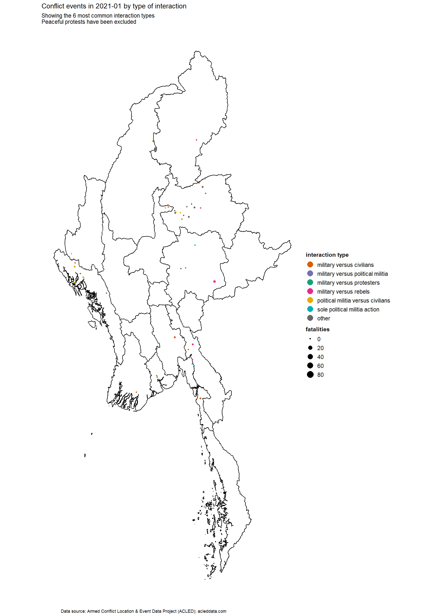

```{css, echo=FALSE}

#TOC::before {
  content: "";
  display: block;
  height: 70px;
  margin: 2em 20px 40px 20px;
  background-image: url("Myanmar_cluster_blue.png");
  background-size: contain;
  background-position: center center;
  background-repeat: no-repeat;
}
```

```{=html}
<style>
    body .main-container {
        max-width: 1280px;
    }
</style>
```


## Introduction

This report provides an overview of the Armed Conflict Location and Event Data Project (ACLED) dataset for Myanmar. This dataset contains information on conflict actors, conflict events, event types, event locations and fatalities dating back to 2010; the data is updated on a monthly basis. With some notable exceptions, this report is largely focused on 2021 data. 

The aim of ACLED is "to capture the forms, agents, dates and locations of political violence and protests"; its methodology for Myanmar consists of the review of English and Myanmar sources to code political violence and demonstration events: the vast majority (85%) of their information originates from subnational, national and international media sources, with the remainder originating from ACLED's partnership with the Myanmar Peace Monitor and reports by the UN, international monitoring groups and local human rights organisations. Points of alignment and divergence from the conflict events collected by the Nexus Response Mechanism's Conflict Analysis and Research Facility remains to be explored.

The terminology employed with this report follows what has been laid out in the ACLED codebook; the review of the codebook, as well as ACLED's methodology notes on Myanmar, is highly encouraged. This report would like to highlight the excellent scholarship of the Armed Conflict Location and Event Data Project, as well as their dedication in making this wealth of data public. This report also echoes ACLED's calls for increased protections for journalists and independent reporting.

<br>

### References for this report
* ACLED, (2019). Armed Conflict Location & Event Data Project (ACLED) Codebook. https://www.acleddata.com/wp-content/uploads/dlm_uploads/2017/10/ACLED_Codebook_2019FINAL_pbl.pdf
* ACLED, (2022). ACLED data for Myanmar (2010-2022). https://acleddata.com
* ACLED, (2020). ACLED Methodology and Coding Decisions around Political Violence in Myanmar. https://acleddata.com/acleddatanew/wp-content/uploads/2021/11/ACLED_Political-Violence-in-Myanmar_February-2020.pdf
* Atillio Benini, Aldo Benini (2021). mdepriv: Synthetic scores of multiple deprivation. R package version 0.0.3.  https://github.com/a-benini/mdepriv/
* Food Security Cluster, Myanmar (2021). 5Ws reporting tool. 

<br><br><br>


```{r setup, include=FALSE}
knitr::opts_chunk$set(echo = FALSE, fig.width=9, message = FALSE, warning=FALSE)
library(tidyverse)
library(readxl)
library(lubridate)
library(stringi)
library(pander)
library(janitor)
library(fuzzyjoin)
library(scales)
library(magrittr)
library(sf)
library(s2)
library(bookdown)
library(data.table)
library(ggsflabel)
library(patchwork)
library(plotly)

library(DT)
library(viridis)
library(widyr)
library(gganimate)
library(gifski)
library(png)
library(transformr)
library(mdepriv)
library(broom)
library(xtable)
library(psych)

theme_set(theme_light())

# disabling scientific notation
options(scipen = 999)

# pander tables all in one row
panderOptions('table.split.table', Inf)

# pander thousands separator
panderOptions("big.mark", ",")

# replace 
opts <- options(knitr.kable.NA = "")

`%out%` <- Negate(`%in%`)

# function for transposing df
transpose_df <- function(df) {
  t_df <- data.table::transpose(df)
  colnames(t_df) <- rownames(df)
  rownames(t_df) <- colnames(df)
  t_df <- t_df %>%
    tibble::rownames_to_column(.data = .) %>%
    tibble::as_tibble(.)
  return(t_df)
}

# function beneficiary summaries
sum_ben <- function(df, column_var){
  
  column_var <- enquo(column_var)
  
  df %>%
    group_by(!!column_var) %>% # must add bang-bang
    summarise(beneficiaries = sum(beneficiaries)) %>% 
    arrange(desc(beneficiaries))
    
}

# function beneficiary summaries, 2 grouped variables
sum_ben2 <- function(df, column_var1, column_var2){
  
  column_var1 <- enquo(column_var1)
  column_var2 <- enquo(column_var2)
  
  df %>%
    group_by(!!column_var1, !!column_var2) %>% # must add bang-bang
    summarise(beneficiaries = sum(beneficiaries)) %>% 
    arrange(desc(beneficiaries))
    
}

# reading in townships from geoadmins 
townships <- read_excel("FSC 5W 2021 - GEOADMINS_final 19.xlsx",
           sheet = "GEOADMINS") %>% 
  clean_names() %>% 
  select(admin1pcode_4:admin3pcode) %>% 
  rename(admin1_pcode = admin1pcode_4,
         admin3_pcode = admin3pcode,
         state_name   = state_5,
         township_name  = county) %>% 
  remove_empty()

# reading in acled
acled <- read_excel("2010-01-01-2022-01-25-Myanmar.xlsx", 
         sheet = "2010-2021-Cleaned") %>% 
  mutate(admin3 = recode(admin3,
                        "Dagon Myothit-South" = "Dagon Myothit (South)",
                        "Dagon Myothit-North" = "Dagon Myothit (North)",
                        "Dagon Myothit-Seikkan" = "Dagon Myothit (Seikkan)",
                        "Dagon Myothit-East" = "Dagon Myothit (East)",
                        "Hlaingtharya-East" = "Hlaingtharya",
                        "Hlaingtharya-West" = "Hlaingtharya",
                        "Pangsang" = "Pangsang (Panghkam)")) %>% 
  # locations in yangon with longlat, but no admin3 have been coded as Kyauktada, where city hall is;
  # similarly, in mandalay, they have been placed in Chanayethazan and Zay yar thi ri in NPT
  mutate(admin3 = case_when(is.na(admin3) & latitude == 16.8052 ~ "Kyauktada",
                           is.na(admin3) & latitude == 19.7450 ~ "Zay Yar Thi Ri",
                           is.na(admin3) & latitude == 21.9747 ~ "Chanayethazan",
                           TRUE ~ admin3)) %>% 
  left_join(townships %>%  
              select(township_name, admin3_pcode), by = c("admin3" = "township_name")) %>% 
  group_by(data_id) %>% 
  slice(which.min(event_id_no_cnty)) %>%
  ungroup() %>% 
  mutate(inter_type = interaction,
         inter_type = recode_factor(inter_type,
                             `10` = "SOLE	MILITARY ACTION",
                             `11` = "MILITARY VERSUS MILITARY",
                             `12` = "MILITARY VERSUS REBELS",
                             `13` = "MILITARY VERSUS POLITICAL MILITIA",
                             `14` = "MILITARY VERSUS COMMUNAL MILITIA",
                             `15` = "MILITARY VERSUS RIOTERS",
                             `16` = "MILITARY VERSUS PROTESTERS",
                             `17` = "MILITARY VERSUS CIVILIANS",
                             `18` = "MILITARY VERSUS OTHER",
                             `20` = "SOLE REBEL ACTION",
                             `22` = "REBELS VERSUS REBELS",
                             `23` = "REBELS	VERSUS POLITICAL MILIITA ",
                             `24` = "REBELS VERSUS COMMUNAL MILITIA",
                             `25` = "REBELS VERSUS RIOTERS",
                             `26` = "REBELS VERSUS PROTESTERS ",
                             `27` = "REBELS VERSUS CIVILIANS",
                             `28` = "REBELS VERSUS OTHERS",
                             `30` = "SOLE POLITICAL MILITIA ACTION",
                             `33` = "POLITICAL MILITIA VERSUS POLITICAL	MILITIA",
                             `34` = "POLITICAL MILITIA VERSUS COMMUNAL	MILITIA",
                             `35` = "POLITICAL MILITIA VERSUS RIOTERS",
                             `36` = "POLITICAL MILITIA VERSUS PROTESTERS",
                             `37` = "POLITICAL MILITIA VERSUS CIVILIANS",
                             `38` = "POLITICAL MILITIA VERSUS OTHERS",
                             `40` = "SOLE COMMUNAL MILITIA ACTION",
                             `44` = "COMMUNAL MILITIA VERSUS COMMUNAL MILITIA",
                             `45` = "COMMUNAL MILITIA VERSUS RIOTERS",
                             `46` = "COMMUNAL	MILITIA	VERSUS PROTESTERS ",
                             `47` = "COMMUNAL MILITIA VERSUS CIVILIANS",
                             `48` = "COMMUNAL MILITIA VERSUS OTHER",
                             `50` = "SOLE RIOTER ACTION",
                             `55` = "RIOTERS VERSUS RIOTERS",
                             `56` = "RIOTERS VERSUS PROTESTERS",
                             `57` = "RIOTERS VERSUS CIVILIANS",
                             `58` = "RIOTERS VERSUS OTHERS",
                             `60` = "SOLE PROTESTER ACTION",
                             `66` = "PROTESTERS VERSUS PROTESTERS",
                             `67` = "PROTESTERS VERSUS CIVILIANS",
                             `68` = "PROTESTERS VERSUS OTHER",
                             `78` = "OTHER ACTOR VERSUS CIVILIANS",
                             `80` = "SOLE OTHER ACTION"), 
         inter_type = tolower(str_trim(str_replace_all(inter_type, "[\\r\\n\\t]+", " ")))) %>% 
  mutate(admin3_pcode = ifelse(admin3_pcode == "MMR007014" & admin1 == "Yangon", "MMR013006", admin3_pcode),
         admin3_pcode = ifelse(admin1 == "Magway" & admin3 == "Minhla", "MMR009013", admin3_pcode)) %>% 
  mutate(has_fatalities = ifelse(fatalities > 0, TRUE, FALSE))

# actor-level dataset
actors <- read_csv("1900-01-01-2022-02-09-Myanmar.csv") %>% 
  mutate(admin3 = recode(admin3,
                        "Dagon Myothit-South" = "Dagon Myothit (South)",
                        "Dagon Myothit-North" = "Dagon Myothit (North)",
                        "Dagon Myothit-Seikkan" = "Dagon Myothit (Seikkan)",
                        "Dagon Myothit-East" = "Dagon Myothit (East)",
                        "Hlaingtharya-East" = "Hlaingtharya",
                        "Hlaingtharya-West" = "Hlaingtharya",
                        "Pangsang" = "Pangsang (Panghkam)")) %>% 
  # locations in yangon with longlat, but no admin3 have been coded as Kyauktada, where city hall is;
  # similarly, in mandalay, they have been placed in Chanayethazan and Zay yar thi ri in NPT
  mutate(admin3 = case_when(is.na(admin3) & latitude == 16.8052 ~ "Kyauktada",
                           is.na(admin3) & latitude == 19.7450 ~ "Zay Yar Thi Ri",
                           is.na(admin3) & latitude == 21.9747 ~ "Chanayethazan",
                           TRUE ~ admin3)) %>% 
  left_join(townships %>%  
              select(township_name, admin3_pcode), by = c("admin3" = "township_name")) %>% 
  left_join(acled %>% 
              select(interaction, inter_type) %>%  distinct(), by = "interaction") %>% 
  mutate(actor_simple = actor1) %>% 
  mutate(actor_simple = 
           case_when(str_detect(actor_simple, "People's Defense Force") ~ "People's Defense Force",
                     str_detect(actor_simple, "Rohingya Muslim Group \\(Myanmar\\)") ~ "Rohingya Muslim Group (Myanmar)",
                     str_detect(actor_simple, "Women \\(Myanmar\\)") ~ "Women (Myanmar)",
                     str_detect(actor_simple, "21 Guerrilla Force") ~ "21 Guerrilla Force",
                     str_detect(actor_simple, "27 Revolution Force") ~ "27 Revolution Force",
                     str_detect(actor_simple, "88 Generation Peace and Open Society") ~ "88 Generation Peace and Open Society",
                     str_detect(actor_simple, "ABFSU") ~ "ABFSU",
                     str_detect(actor_simple, "Aid Workers \\(Myanmar\\)") ~ "Aid Workers (Myanmar)",
                     str_detect(actor_simple, "Ayadaw Bone Naing PDF") ~ "Ayadaw Bone Naing PDF",
                     str_detect(actor_simple, "Baptist Christian Group") ~ "Baptist Christian Group (Myanmar)",
                     str_detect(actor_simple, "Buddhist Group") ~ "Buddhist Group (Myanmar)", 
                     str_detect(actor_simple, "CDF: Chinland Defense Force") ~ "CDF: Chinland Defense Force",
                     str_detect(actor_simple, "Chin Ethnic Group") ~ "Chin Ethnic Group (Myanmar)",
                     str_detect(actor_simple, "Chinese Ethnic Group") ~ "Chinese Ethnic Group (Myanmar)",
                     str_detect(actor_simple, "Christian Group")~ "Christian Group (Myanmar)",
                     str_detect(actor_simple, "Civilians \\(Myanmar\\)") ~ "Civilians (Myanmar)",
                     str_detect(actor_simple, "CNO/CNDF") ~ "CNO/CNDF: Chin National Organization/Chin National Defense Force",
                     str_detect(actor_simple, "DKBA \\(Buddhist\\)") ~ "DKBA (Buddhist): Democratic Karen Buddhist Army",
                     str_detect(actor_simple, "Farmers \\(Myanmar\\)") ~ "Farmers (Myanmar)",
                     str_detect(actor_simple, "Democratic Guerrilla Force") ~ "Democratic Guerrilla Force",
                     str_detect(actor_simple, "DGWCF") ~ "DGWCF: Delta Guerrilla Warfare Collective Forces",
                     str_detect(actor_simple, "Former Government of Myanmar \\(2016-\\)") ~ "Former Government of Myanmar (2016-)",
                     str_detect(actor_simple, "Former Government of Myanmar \\(2021-\\)") ~ "Former Government of Myanmar (2021-)",
                     str_detect(actor_simple, "Former Military Forces of Myanmar \\(2016-2021\\)") ~ 
                       "Former Military Forces of Myanmar (2016-2021)",
                     str_detect(actor_simple, "Former Military Forces of Myanmar \\(2021-\\)") ~ 
                       "Former Military Forces of Myanmar (2021-)",
                     str_detect(actor_simple, "Government of Myanmar \\(2011-2016\\)") ~ "Government of Myanmar (2011-2016)",
                     str_detect(actor_simple, "Government of Myanmar \\(2016-\\)") ~ "Government of Myanmar (2016-)",
                     str_detect(actor_simple, "Government of Myanmar \\(2021-\\)") ~ "Government of Myanmar (2021-)",
                     str_detect(actor_simple, "Health Workers \\(Myanmar\\)") ~ "Health Workers (Myanmar)",
                     str_detect(actor_simple, "Journalists \\(Myanmar\\)") ~ "Journalists (Myanmar)",
                     str_detect(actor_simple, "Kachin Ethnic Group \\(Myanmar\\)") ~ "Kachin Ethnic Group (Myanmar)", 
                     str_detect(actor_simple, "Kayah Ethnic Group \\(Myanmar\\)")~ "Kayah Ethnic Group (Myanmar)",
                     str_detect(actor_simple, "Kayin Ethnic Group \\(Myanmar\\)")~ "Kayin Ethnic Group (Myanmar)",
                     str_detect(actor_simple, "Karenni Democratic Front") ~ "KDF: Karenni Democratic Front",
                     str_detect(actor_simple, "KIO/KIA") ~ "KIO/KIA: Kachin Independence Organization/Kachin Independence Army",
                     str_detect(actor_simple, "Karenni Nationalities Defense Force") ~ "KNDF: Karenni Nationalities Defense Force",
                     str_detect(actor_simple, "Karenni National Progressive Party") ~ "KNPP/KA: Karenni National Progressive Party/Karenni Army",
                     str_detect(actor_simple, "Karen National Union") ~ "KNU/KNLA: Karen National Union/Karen National Liberation Army",
                     str_detect(actor_simple, "Knights Of The Red Land") ~ "KORL: Knights Of The Red Land",
                     str_detect(actor_simple, "KNU/KNLA Peace Council") ~ "KPC: KNU/KNLA Peace Council",
                     str_detect(actor_simple, "LGBT \\(Myanmar\\)") ~ "LGBT (Myanmar)",
                     str_detect(actor_simple, "Labour Group \\(Myanmar\\)") ~ "Labour Group (Myanmar)",
                     str_detect(actor_simple, "Lisu Ethnic Group \\(Myanmar\\)") ~ "Lisu Ethnic Group (Myanmar)",
                     str_detect(actor_simple, "MG6 Guerrilla Force") ~ "MG6 Guerrilla Force",
                     str_detect(actor_simple, "MHG: Monywa Heroes Group") ~ "MHG: Monywa Heroes Group",
                     str_detect(actor_simple, "MHH: Mungshawa Hpyen Hpung") ~ "MHH: Mungshawa Hpyen Hpung",
                     str_detect(actor_simple, "Border Guard Force") ~ "Military Forces of Myanmar - Border Guard Force",
                     str_detect(actor_simple, "Police Forces of Myanmar") ~ "Police Forces of Myanmar",
                     str_detect(actor_simple, "People's Militia Force") ~ "People's Militia Force",
                     str_detect(actor_simple, "Military Forces of Myanmar") ~ "Military Forces of Myanmar",
                     str_detect(actor_simple, "MNTJP/MNDAA: Myanmar National Truth and Justice Party/Myanmar National Democratic Alliance Army") ~ 
                       "MNTJP/MNDAA: Myanmar National Truth and Justice Party/Myanmar National Democratic Alliance Army",
                     str_detect(actor_simple, "Mon Ethnic Group \\(Myanmar\\)") ~ "Mon Ethnic Group (Myanmar)",
                     str_detect(actor_simple, "Monywa Nightking") ~ "Monywa Nightking",
                     str_detect(actor_simple, "Monywa Young People Group") ~ "Monywa Young People Group",
                     str_detect(actor_simple, "Mro Ethnic Group \\(Myanmar\\)") ~ "Mro Ethnic Group (Myanmar)",
                     str_detect(actor_simple, "MTHSF: Mon Thaton Special Forces") ~ "MTHSF: Mon Thaton Special Forces",
                     str_detect(actor_simple, "Muslim Group \\(Myanmar\\)") ~ "Muslim Group (Myanmar)",
                     str_detect(actor_simple, "MWVA: Myanmar War Veterans' Association") ~ "MWVA: Myanmar War Veterans' Association",
                     str_detect(actor_simple, "NLD: National League for Democracy") ~ "NLD: National League for Democracy",
                     str_detect(actor_simple, "Pa-Oh Ethnic Group \\(Myanmar\\)") ~ "Pa-Oh Ethnic Group (Myanmar)",
                     str_detect(actor_simple, "Palaung/Ta'ang Ethnic Group \\(Myanmar\\)") ~ "Palaung/Ta'ang Ethnic Group (Myanmar)",
                     str_detect(actor_simple, "Pale Joker PDF") ~ "Pale Jokers PDF",
                     str_detect(actor_simple, "People's Defense Froce") ~ "People's Defense Force",
                     str_detect(actor_simple, "People Defense Froce") ~ "People's Defense Force",
                     str_detect(actor_simple, "People's Guerrillas Commando") ~ "People's Guerrillas Commando",
                     str_detect(actor_simple, "People's Militia Force") ~ "People's Militia Force",
                     str_detect(actor_simple, "Phoenix Defense Force") ~ "Phoenix Defense Force", 
                     str_detect(actor_simple, "Phoenix Special Guerrilla Force") ~ "Phoenix Special Guerrilla Force",
                     str_detect(actor_simple, "PNO/PNA: Pa-Oh National Organization/Pa-Oh National Army") ~ 
                       "PNO/PNA: Pa-Oh National Organization/Pa-Oh National Army",
                     str_detect(actor_simple, "Prisoners \\(Myanmar\\)") ~ "Prisoners (Myanmar)",
                     str_detect(actor_simple, "PSLF/TNLA: Palaung State Liberation Front/Ta'ang National Liberation Army") ~ 
                       "PSLF/TNLA: Palaung State Liberation Front/Ta'ang National Liberation Army",
                     str_detect(actor_simple, "Rakhine Ethnic Group \\(Myanmar\\)") ~ "Rakhine Ethnic Group (Myanmar)",
                     str_detect(actor_simple, "RCSS/SSA-S: Restoration Council of Shan State/Shan State Army-South") ~ 
                       "RCSS/SSA-S: Restoration Council of Shan State/Shan State Army-South",
                     str_detect(actor_simple, "Refugees/IDPs \\(Myanmar\\)") ~ "Refugees/IDPs (Myanmar)",
                     str_detect(actor_simple, "Shan Ethnic Group \\(Myanmar\\)") ~ "Shan Ethnic Group (Myanmar)",
                     str_detect(actor_simple, "Students \\(Myanmar\\)") ~ "Students (Myanmar)",
                     str_detect(actor_simple, "Teachers \\(Myanmar\\)") ~ "Teachers (Myanmar)",
                     str_detect(actor_simple, "ULA/AA: United League of Arakan/Arakan Army") ~ "ULA/AA: United League of Arakan/Arakan Army",
                     str_detect(actor_simple, "ULFA-I: United Liberation Front of Asom-Independent") ~ 
                       "ULFA-I: United Liberation Front of Asom-Independent",
                     str_detect(actor_simple, "Urban Guerrilla Group") ~ "Urban Guerrilla Group", 
                     str_detect(actor_simple, "USDP: Union Solidarity and Development Party") ~ "USDP: Union Solidarity and Development Party",
                     str_detect(actor_simple, "Zero Guerrilla Force") ~ "Zero Guerrilla Force",
                     str_detect(actor_simple, "DNP: Democratic Party of National Politics") ~ "DNP: Democratic Party of National Politics",
                     str_detect(actor_simple, "Hlaw Tet In Ahr Su 126: Rowing Force 126") ~ "Hlaw Tet In Ahr Su 126: Rowing Force 126",
                     TRUE ~ actor_simple)) %>%  
  mutate(inter1 = recode(inter1, 
                         `1` = "state_forces",
                         `2` = "rebel_groups",
                         `3` = "political_militias",
                         `4` = "identity_militias",
                         `5` = "rioters",
                         `6` = "protesters",
                         `7` = "civilians", 
                         `8` = "external_other_force")) %>%  
  mutate(inter1 = fct_relevel(inter1, c("external_other_force", "identity_militias", "rioters", "rebel_groups", 
                                        "political_militias", "state_forces", "civilians", "protesters"))) %>% 
  mutate(event_type = fct_relevel(event_type, c("Battles", "Explosions/Remote violence", "Violence against civilians",
                                                "Protests", "Riots", "Strategic developments"))) %>% 
  mutate(has_fatalities = ifelse(fatalities > 0, TRUE, FALSE))

# shapefiles
pcode3_shape <- st_read("./mmr_polbnda_adm3_mimu_250k/mmr_polbnda_adm3_mimu_250k.shp", quiet = TRUE) %>% 
 rename(state = ST, 
        admin1_pcode = ST_PCODE,
        township = TS,
        admin3_pcode = TS_PCODE) %>% 
 mutate(admin3_pcode = ifelse(str_detect(township, "Hlaingtharya"), "MMR013008", admin3_pcode))

pcode1_shape <- st_read("./mmr_polbnda2_adm1_mimu_250k/mmr_polbnda2_adm1_mimu_250k.shp", quiet = TRUE) %>% 
 rename(state = ST, 
        admin1_pcode = ST_PCODE) %>% st_as_sf()

# reading in townships from geoadmins 
townships <- read_excel("FSC 5W 2021 - GEOADMINS_final 19.xlsx",
           sheet = "GEOADMINS") %>% 
  clean_names() %>% 
  select(admin1pcode_4:admin3pcode) %>% 
  rename(admin1_pcode = admin1pcode_4,
         admin3_pcode = admin3pcode,
         state_name   = state_5,
         township_name  = county) %>% 
  remove_empty()

# reading in 5Ws
fsc <- read_csv("fsc5w_2021.csv")
```


## 1. Progression of conflict events by interaction type in 2021

The GIF  below shows 2021 conflict events by **month**. The colour of each point indicates the interaction type -- the 6 most common interaction types have been included and less frequent types have been recoded as "Other" -- and the number of fatalities associated with each event is indicated by the size of each point. 

<br>



<br><br><br>


## 2. Distribution of food security partners and conflict events in 2021 

There is, in general, a dearth of partners in the parts of the country most affected by conflict. Battles and explosions and remote violence were most prevalent in Sagaing, and, to lesser extents Kachin and Shan North. 

<br>

```{r map-events-fsc-parnters, fig.height=10}
acled %>% 
  filter(year == 2021 & sub_event_type != "Peaceful protest") %>%
  full_join(fsc %>%
              group_by(admin3_pcode) %>% 
              summarise(partners = n_distinct(implementing_partners)), by = "admin3_pcode") %>% 
  left_join(townships %>%  
              select(admin1_pcode, admin3_pcode), by = "admin3_pcode") %>% 
  right_join(pcode3_shape, by = "admin3_pcode") %>% 
  st_as_sf() %>% 
  ggplot() +
  geom_sf(aes(fill = partners), size = 0.1) + 
  geom_point(aes(x = longitude, y = latitude), size = 0.5, alpha = 0.4, colour = "red") +
  geom_sf(data = pcode1_shape, alpha = 0, colour = "black", size = 0.5) +
  scale_fill_viridis_c(option = "mako", direction = -1, breaks = c(1, 3, 6, 9, 12)) + 
  theme_void() +
  labs(title = "Distribution of food security partners and conflict events in 2021",
       subtitle =  "Red dots are conflict events; peaceful protests have been excluded",
       caption = "Data sources: Armed Conflict Location & Event Data Project (ACLED); acleddata.com and Food Security Cluster Myanmar",
       fill = "number of\npartners") + 
  theme(plot.caption = element_text(hjust = 0.5))
```
 
 <br><br><br>


## 3. Summaries by event type

### 3.1 Annual distribution of conflict events

The plot below shows a massive spike in conflict events in 2021, bearing in mind that Myanmar has long been embroiled in a 70-year civil war. 

```{r barplot-year-events}
acled %>% 
  filter(!is.na(event_type) & year < 2022) %>%
  mutate(year = round(year)) %>% 
  group_by(year, event_type) %>%
  summarise(count = n(), .groups = "drop") %>%
  ggplot(aes(year, count, fill = event_type, group = event_type)) + 
  # geom_line(size = 1) + 
  geom_col() +
  geom_text(aes(label = comma(stat(y), accuracy = 1), group = year), stat = "summary", fun = sum, vjust = -0.7, size = 3) +
  scale_x_continuous(breaks = seq(2010, 2021, by = 1)) + 
  scale_y_continuous(labels = comma, limits = c(0, 17000)) +
  theme(axis.text.x = element_text(size = 9), 
        axis.text.y = element_text(size = 9), 
        legend.text = element_text(size = 5),
        legend.title = element_text(size = 6),
        plot.caption = element_text(hjust = 0.5)) +
  labs(x = "", 
       y = "Number of events",
       title = "Conflict events by event type, 2010-2021", 
       caption = "Data source: Armed Conflict Location & Event Data Project (ACLED); acleddata.com")

```

<br>


The 2021 breakdown of conflict events in 2021 was:

```{r conflict-events-summary-2021}
acled %>%  
  filter(year == 2021) %>% 
  group_by(event_type) %>% 
  summarise(count = n()) %>% 
  mutate(percentage = round(count / sum(count) * 100, digits = 2)) %>% 
  arrange(desc(percentage)) %>% 
  knitr::kable(caption = "2021 event types by percentage of total", format.args = list(big.mark = ","))  
 # kable_classic_2("striped", full_width = FALSE, position = "left") %>%  
 # footnote(general = "Data source: Armed Conflict Location & Event Data Project (ACLED); acleddata.com", general_title = "")
```

<br><br>

### 3.2 Annual distribution of fatalities by event type

There were more conflict fatalities in 2021 than from 2010 to 2020 combined. There were more fatalities related to violence against civilians alone than all conflict-related fatalities in 2019, which previously had the highest number of fatalities this decade.  

```{r barplot-year-fatalties}
acled %>% 
  filter(!is.na(event_type) & year < 2022) %>%
  mutate(year = round(year)) %>% 
  group_by(year, event_type) %>%
  summarise(fatalities = sum(fatalities), .groups = "drop") %>%
  ggplot(aes(year, fatalities, fill = event_type, group = event_type)) + 
  # geom_line(size = 1) + 
  geom_col() +
  geom_text(aes(label = comma(stat(y), accuracy = 1), group = year), stat = "summary", fun = sum, vjust = -0.7, size = 3) +
  scale_x_continuous(breaks = seq(2010, 2021, by = 1)) + 
  scale_y_continuous(labels = comma, limits = c(0, 12500)) +
  theme(axis.text.x = element_text(size = 9), 
        axis.text.y = element_text(size = 9), 
        legend.text = element_text(size = 5),
        legend.title = element_text(size = 6),
        plot.caption = element_text(hjust = 0.5)) +
  labs(x = "", 
       y = "Number of conflict-related fatalities",
       title = "Fatalities by conflict event type, 2010-2021", 
       caption = "Data source: Armed Conflict Location & Event Data Project (ACLED); acleddata.com")


```

<br>

For reference, the 2021 breakdown of fatalities by event type was:

```{r fatalities-summary-2021}
acled %>%  
  filter(year == 2021) %>% 
  group_by(event_type) %>% 
  summarise(fatalities = sum(fatalities)) %>% 
  mutate(percentage = round(fatalities / sum(fatalities) * 100, digits = 2)) %>% 
  arrange(desc(percentage)) %>% 
  knitr::kable(caption = "2021 conflict fatalities by event type", format.args = list(big.mark = ","))
  #kable_classic_2("striped", full_width = FALSE, position = "left") %>%  
  #footnote(general = "Data source: Armed Conflict Location & Event Data Project (ACLED); acleddata.com", general_title = "")
```

<br><br>

### 3.3 Geographic distribution of conflict events

```{r state-events-plot}

acled %>% 
  filter(year == 2021) %>% 
  group_by(admin1, event_type) %>% 
  summarise(count = n()) %>% 
  mutate(sum = sum(count)) %>% 
  ungroup() %>% 
  mutate(admin1 = fct_reorder(admin1, sum, .desc = TRUE)) %>% 
  ggplot(aes(x = admin1, y = count, fill = event_type)) + 
  geom_col() +
  geom_text(aes(label = comma(stat(y), accuracy = 1), group = admin1), stat = "summary", fun = sum, vjust = -0.5, size = 3) +
  scale_y_continuous(labels = comma, breaks = seq(0, 3800, by = 1000)) +
  theme(axis.text.x = element_text(size = 7, hjust = 1, angle = 60), 
        axis.text.y = element_text(size = 9), 
        legend.text = element_text(size = 5),
        legend.title = element_text(size = 6),
        plot.caption = element_text(hjust = 0.5)) +
  labs(x = "", 
       y = "Number of conflict events",
       title = "2021 conflict events by state/region", 
       caption = "Data source: Armed Conflict Location & Event Data Project (ACLED); acleddata.com")


  
```

<br>

Sagaing saw the highest number of conflict events as well as fatalities in 2021, in particular, it experienced more than three times as many conflict-related fatalities than the next highest region, Magway. This is a significant shift in the pattern of conflict in Myanmar, which has traditionally revolved around Kachin, Rakhine and Shan. 

<br>

```{r state-fatalities-plot}

acled %>% 
  filter(year == 2021) %>% 
  group_by(admin1, event_type) %>% 
  summarise(fatalities = sum(fatalities)) %>% 
  mutate(sum = sum(fatalities)) %>% 
  ungroup() %>% 
  mutate(admin1 = fct_reorder(admin1, sum, .desc = TRUE)) %>% 
  ggplot(aes(x = admin1, y = fatalities, fill = event_type)) + 
  geom_col() +
  geom_text(aes(label = comma(stat(y), accuracy = 1), group = admin1), stat = "summary", fun = sum, vjust = -0.5, size = 3) +
  scale_y_continuous(labels = comma, breaks = seq(0, 5000, by = 1000)) +
  theme(axis.text.x = element_text(size = 7, hjust = 1, angle = 60), 
        axis.text.y = element_text(size = 9), 
        legend.text = element_text(size = 5),
        legend.title = element_text(size = 6),
        plot.caption = element_text(hjust = 0.5)) +
  labs(x = "", 
       y = "Number of fatalities",
       title = "2021 conflict-related fatalities by state/region", 
       caption = "Data source: Armed Conflict Location & Event Data Project (ACLED); acleddata.com")
 
```

plot year-on-year increase by state and region 

<br><br><br>

## 4. Conflict actors

### 4.1 Conflict events by type of actor 

The next two sections summarise conflict events and fatalities by event type and actor type. For the plots below, one should bear in mind that most event types (with the exception of peaceful protests) involved more than one actor, so totalling up each facet will result in a number higher than the total number of events. For instance, the same battle involving state forces and rebel groups would show up in the event counts of each.  

<br>

```{r actor-facet-event-count, fig.height = 7}

actors %>%
  mutate(event_type = fct_relevel(event_type, c("Battles", "Explosions/Remote violence", "Violence against civilians",
                                                "Protests", "Riots", "Strategic developments"))) %>% 
  mutate(inter1 = fct_relevel(inter1, c("state_forces", "protesters", "civilians", "political_militias", "rebel_groups",
                                        "rioters", "identity_militias", "external_other_force"))) %>% 
  filter(year == 2021) %>% 
  group_by(actor_simple, event_type, inter1) %>% 
  summarise(count = n(),
            fatalities = sum(fatalities)) %>% 
  group_by(event_type) %>% 
  # filter(inter1 != "identity_militias") %>% 
  ggplot(aes(x = count, y = event_type, fill = event_type)) +
  geom_col() +
  scale_x_continuous(labels = comma) +
  # scale_fill_viridis_d() +
  facet_wrap(~ inter1, scales = "free_x") + 
  theme(legend.position = "none",
        plot.caption = element_text(hjust = 0.5)) +
  labs(x = "Number of conflict events associated with each actor type", 
       y = "Type of conflict event", 
       title = "Number of conflict events associated with each actor type",
       subtitle = "Faceted by type of conflict actor",
       caption = "Data source: Armed Conflict Location & Event Data Project (ACLED); acleddata.com")


```

<br>

```{r summary-table-event_type}
actors %>% 
  mutate(inter1 = fct_relevel(inter1, c("state_forces", "protesters", "civilians", "political_militias", "rebel_groups",
                                        "rioters", "identity_militias", "external_other_force"))) %>% 
  filter(year == 2021) %>% 
  group_by(actor_type = inter1) %>% 
  summarise(events = n()) %>%  
  transpose_df() %>% 
  row_to_names(row_number = 1) %>% 
  mutate_at(vars("protesters", "civilians", "state_forces", "political_militias", "rebel_groups",
                                        "rioters", "identity_militias", "external_other_force"),
            ~ as.numeric(.x)) %>% 
  knitr::kable(caption = "2021 number of conflict events by actor type", format.args = list(big.mark = ","), digits = 0) 
  # kable_classic_2() %>% 
  # footnote(general = "Data source: Armed Conflict Location & Event Data Project (ACLED); acleddata.com",
  #         general_title = "")
```

<br><br>

### 4.2 Fatalities by actor type

The plot below on fatalities shows the number of fatalities associated with each type of actor. It should be noted that the ACLED dataset does not have a column to assign blame, neither are the specific details of the fatalities always known -- there is additional information in the column `notes` and text mining would be a fruitful next step for future analysis, but has not been performed for this cursory overview of the data. And similar to the plot on event types above, duplications have been included, though not within the totals for each actor type. 

For instance, under fatalities related to protests, `r filter(actors, inter1 == "protesters") %>% {sum(.$fatalities)}` fatalities were associated with protesters, with the main other party involved almost entirely being state forces, with very small numbers being associated with rioters. 

<br>

```{r actor-facet-event-fatalities, fig.height=7}

actors %>%
  mutate(event_type = fct_relevel(event_type, c("Battles", "Explosions/Remote violence", "Violence against civilians",
                                                "Protests", "Riots", "Strategic developments"))) %>% 
  mutate(inter1 = fct_relevel(inter1, c("state_forces", "protesters", "civilians", "political_militias", "rebel_groups",
                                        "rioters", "identity_militias", "external_other_force"))) %>% 
  filter(year == 2021) %>% 
  group_by(actor_simple, event_type, inter1) %>% 
  summarise(count = n(),
            fatalities = sum(fatalities)) %>% 
  group_by(event_type) %>% 
  filter(inter1 %out% c("external_other_force")) %>% 
  mutate(pc_total = count / sum(count)) %>% 
  ggplot(aes(x = fatalities, y = event_type, fill = event_type)) +
  geom_col() +
  scale_x_continuous(labels = comma) +
  # scale_fill_viridis_d() +
  facet_wrap(~ inter1, scales = "free_x") + 
  theme(legend.position = "none",
        plot.caption = element_text(hjust = 0.5)) +
  labs(x = "Number of fatalities associated with each actor type", 
       y = "Type of conflict event", 
       title = "Number of fatalities associated with each actor type",
       subtitle = "Faceted by type of conflict actor",
       caption = "Data source: Armed Conflict Location & Event Data Project (ACLED); acleddata.com")

```
<br>

```{r summary-table-fatalities}
actors %>% 
  mutate(inter1 = fct_relevel(inter1, c("state_forces", "protesters", "civilians", "political_militias", "rebel_groups",
                                        "rioters", "identity_militias", "external_other_force"))) %>% 
  filter(year == 2021) %>% 
  group_by(actor_type = inter1) %>% 
  summarise(fatalities = sum(fatalities)) %>%  
  transpose_df() %>% 
  row_to_names(row_number = 1) %>% 
  mutate_at(vars("protesters", "civilians", "state_forces", "political_militias", "rebel_groups",
                                        "rioters", "identity_militias", "external_other_force"),
            ~ as.numeric(.x)) %>% 
  knitr::kable(caption = "2021 number of fatalities associated with each actor type", format.args = list(big.mark = ","), digits = 0) 
  #kable_classic_2() %>% 
  #footnote(general = "Data source: Armed Conflict Location & Event Data Project (ACLED); acleddata.com",
  #         general_title = "")
```

<br><br>


### 4.3 Which actors are associated with the most fatalities?

As mentioned, it is difficult at this juncture to state how many of the associated fatalities were persons killed by these groups and how many were members of these groups had been the ones who were killed. Still, it is worthwhile to plot which actors are the "bloodiest", at least in regards to the outcomes of their actions, or have been involved in incidents with the most fatalities. 

The plot below seeks to examine which actors have been associated with the most fatalities per event, and only actors which have participated in more than 50 conflict events have been included. The point shows the average number of fatalities associated with each actor per conflict event it was involved in. The whiskers show the upper and lower ranges of fatalities per event, that is, 95% of all conflict events that an actor participated in fell within that range. The highest numbers of fatalities per event are associated with political militias and rebel groups.  

<br>

```{r fatalities-actors-errorbarh, fig.height=6}
actors_conf_int <- actors %>%  
  filter(year == 2021) %>% 
  add_count(actor_simple) %>% 
  filter(n > 50) %>% 
  nest(-actor_simple) %>% 
  mutate(model = map(data, ~ t.test(.$fatalities))) %>% 
  unnest_legacy(map(model, tidy))

actors_conf_int %>%  
  left_join(actors %>% select(actor_simple, inter1) %>% distinct(), by = "actor_simple") %>% 
  mutate(inter1 = fct_relevel(inter1, c("protesters", "civilians", "state_forces", "political_militias", "rebel_groups",
                                        "rioters", "identity_militias", "external_other_force"))) %>% 
  mutate(actor_simple = str_remove(actor_simple, "\\:.*"),
         actor_simple = fct_reorder(actor_simple, estimate)) %>% 
  ggplot(aes(x = estimate, y = actor_simple, colour = inter1)) + 
  geom_point(size = 2) + 
  geom_errorbarh(aes(xmin = conf.low, xmax = conf.high), size = 0.5) + 
  scale_colour_viridis_d(direction = -1) +
  scale_x_continuous(breaks = seq(0, 7, by = 1)) +
  # scale_colour_brewer(palette = "Dark2") + 
  labs(x = "Average number of fatalities per conflict event",
      y = "Conflict actor", 
      title = "Which conflict actors are associated with the most fatalities?", 
      subtitle = "Only includes actors involved in more than 50 conflict events", 
      caption = "Data source: Armed Conflict Location & Event Data Project (ACLED); acleddata.com",
      colour = "") + 
  theme(plot.caption = element_text(hjust = 0.5), 
        legend.text = element_text(size = 6), 
        legend.position = "bottom") +
  guides(colour = guide_legend(nrow = 1))

```

<br>

The table below summarises the number of fatalities and conflict events associated with the largest actors. The table has been sorted in descending order of number of fatalities; only actors associated with more than 100 fatalities are shown and all other actors have been lumped together as "Other". 

```{r table-fatalities-summary}
actors %>% 
  filter(year == 2021) %>% 
  group_by(actor_simple) %>% 
  summarise(fatalities = sum(fatalities),
            events = n()) %>% 
  mutate(actor_simple = ifelse(fatalities >= 100, actor_simple, "Other")) %>% 
  group_by(actor_simple) %>% 
  summarise(fatalities = sum(fatalities),
            events = sum(events)) %>%
  left_join(actors %>% select(actor_simple, inter1) %>% distinct(), by = "actor_simple") %>% 
  mutate(actor_simple = str_remove(actor_simple, "\\:.*"),
         fatalities_per_event = round(fatalities / events, digits = 2)) %>% 
  select(actor = actor_simple, actor_type = inter1, fatalities, events, fatalities_per_event) %>% 
  arrange(desc(fatalities)) %>%
  knitr::kable(caption = "Top 2021 actors in terms of fatalities; actors associated with less than 100 fatalities have been lumped together as 'Other'",
        format.args = list(big.mark = ","))
#  kable_classic_2("striped") %>% 
#  footnote(general = "Data source: Armed Conflict Location & Event Data Project (ACLED); acleddata.com", 
#           general_title = "")

```

<br><br> 

### 4.4 Summary table of main conflict actors

```{r table-main-conflict-actors}
top_actors <- actors %>%  
  mutate(inter1 = fct_relevel(inter1, c("state_forces", "protesters", "civilians", "political_militias", "rebel_groups",
                                        "rioters", "identity_militias", "external_other_force"))) %>% 
  filter(year == 2021) %>% 
  count(inter1, actor_simple, sort = TRUE) %>% 
  group_by(inter1) %>% 
  mutate(`%_of_group` = round(n / sum(n) * 100, digits = 2)) %>%
  rename(events = n,
         actor_type = inter1,
         actor_name = actor_simple) %>% 
  top_n(n = 5) %>%  arrange(actor_type)

knitr::kable(top_actors, caption = "Top 5 conflict actors in 2021 by actor type", format.args = list(big.mark = ",")) 
#  pack_rows(index = table(top_actors$actor_type)) 
#  kable_classic_2("striped") %>%  
#  footnote(general = "Data source: Armed Conflict Location & Event Data Project (ACLED); acleddata.com", 
#           general_title = "")
#
  
```

<br><br>

### 4.5 Geographic distribution of conflict actors

```{r map-conflict-actors-township, fig.height=10}
actors %>% 
  filter(year == 2021) %>% 
  group_by(admin3_pcode) %>% 
  summarise(conflict_actors = n_distinct(actor_simple)) %>% 
  left_join(pcode3_shape, by = "admin3_pcode") %>% 
  st_as_sf() %>% 
  ggplot() + 
  geom_sf(aes(fill = conflict_actors), size = 0.01) +
  geom_sf(data = pcode1_shape, size = 0.5, colour = "black", alpha = 0) + 
  scale_fill_viridis_c(option = "inferno", direction = -1) +
  theme_void() +
  labs(fill = "number of\n conflict actors",
       title = "Distribution of 2021 conflict actors at township level",
       caption = "Data source: Armed Conflict Location & Event Data Project (ACLED); acleddata.com")
  
```


<br><br><br>

## 5. Correlations between conflict and food security cluster footprint 


### 5.1 Correlation plot

```{r conflict-score-df, warning=FALSE}
conflict_df <- acled %>% 
  # do you really need this step since you're using Betti-Verma
  mutate(event_type = case_when(event_type == "Protests" ~ "Protests_and_Riots",
                                event_type == "Riots" ~ "Protests_and_Riots", 
                                TRUE ~ event_type)) %>% 
  filter(year == 2021 & sub_event_type != "Peaceful protest") %>%
  group_by(admin3_pcode, event_type) %>% 
  summarise(count = n(), .groups = "drop") %>%  
  pivot_wider(names_from = event_type, values_from = count) %>% 
  clean_names() %>% 
  replace_na(list(battles = 0, explosions_remote_violence = 0, violence_against_civilians = 0,
                  strategic_developments = 0, protests_and_riots = 0)) %>% 
  # mutate(total_events = rowSums(across(where(is.numeric)), na.rm = TRUE)) %>% 
  left_join(acled %>% 
              filter(year == 2021) %>% 
              group_by(admin3_pcode) %>% 
              summarise(fatalities = sum(fatalities)), by = "admin3_pcode") %>% 
  ungroup()
  
index_shares <- conflict_df %>%   
  mutate_at(vars(c(battles, explosions_remote_violence, violence_against_civilians, fatalities,
                   strategic_developments, protests_and_riots)), 
           scale) %>%  
  mutate_at(vars(c(battles, explosions_remote_violence, violence_against_civilians, fatalities,
                   strategic_developments, protests_and_riots)), 
           funs((. - min(., na.rm = T))/(max(., na.rm = T) - min(., na.rm = T)))) %>% 
  mdepriv(c("battles", "explosions_remote_violence", "violence_against_civilians", "fatalities", "strategic_developments", "protests_and_riots"),
          method = "bv", output = "all")

conflict_score <- conflict_df %>% 
  left_join(index_shares$data %>% 
              select(admin3_pcode, 
                     score_i,
                     index_battles = battles, 
                     index_explosions_remote_violence = explosions_remote_violence,
                     index_violence_against_civilians = violence_against_civilians, 
                     index_fatalities = fatalities, 
                     index_strategic_developments = strategic_developments, 
                     index_protests_and_riots = protests_and_riots), by = "admin3_pcode") %>% 
  mutate(env_battles = battles / max(battles), 
         env_explosions_remote_violence = explosions_remote_violence / max(explosions_remote_violence),
         env_violence_against_civilians = violence_against_civilians / max(violence_against_civilians), 
         env_fatalities = fatalities / max(fatalities), 
         score_env = (env_battles + env_explosions_remote_violence + env_violence_against_civilians + env_fatalities) / 4) %>% 
  left_join(acled %>% 
              distinct(admin1, admin3, admin3_pcode), by = "admin3_pcode") %>% 
  left_join(fsc %>%  
              group_by(admin3_pcode) %>% 
              summarise(partners = n_distinct(implementing_partners),
                        beneficiaries = sum(beneficiaries[unique_beneficiaries == "Yes"])), by = "admin3_pcode")

```

The correlation plot below examines the specific relationships between the individual variables in the dataset -- the histograms down the diagonal show the distributions of townships across the various values; the correlations between variables (all between 0 and 1) are shown in the upper triangle, with the asterisks denoting how significant the correlations are; and the lower triangle shows the specific distribution of observations, with each point representing each township. Beneficiaries have been placed on a logarithmic scale so that the variation is more visible. 

For instance, violence against civilians is highly correlated with strategic developments (with a coefficient of 0.79) -- this means that in the townships where strategic developments occurred (the most common strategic developments were arrests and looting/property damage), violence against civilians also likely occurred. 

<br>

```{r corrplot, fig.height=7.5}
conflict_score %>% 
  mutate(log_beneficiaries = log(beneficiaries)) %>% 
  select(battles, explosions_remote_violence, violence_against_civilians, protests_and_riots, strategic_developments, 
         fatalities, partners, log_beneficiaries) %>%
  pairs.panels(smooth = TRUE,      # If TRUE, draws loess smooths
               scale = FALSE,      # If TRUE, scales the correlation text font
               density = TRUE,     # If TRUE, adds density plots and histograms
               ellipses = FALSE,   # If TRUE, draws ellipses
               method = "pearson", # Correlation method (also "spearman" or "kendall")
               pch = 8,            # pch symbol
               lm = TRUE,          # If TRUE, plots linear fit rather than the LOESS (smoothed) fit
               cor = TRUE,         # If TRUE, reports correlations
               jiggle = FALSE,     # If TRUE, data points are jittered
               factor = 2,         # Jittering factor
               hist.col = 4,       # Histograms color
               stars = TRUE,       # If TRUE, adds significance level with stars
               ci = FALSE,         # If TRUE, adds confidence intervals
               main = "Correlation plot of conflict indicators (acleddata.com) and FSC partners and beneficiaries")
```

<br>

The numbers of partners and beneficiaries per township were, unsurprisingly, correlated with each other. However, the number of partners per townships was only slightly correlated with the number of battles and the number of explosions and remote violence -- this pattern likely only holds for certain states. The number of beneficiaries reached is not correlated with any conflict indicators.  

The various conflict indicators -- as expected -- are highly correlated with each other, with the strongest relationship being between violence against civilians and strategic developments. For reference, the specific sub-events under strategic developments are listed below: 


```{r strat-dev-table} 
acled %>%  filter(year == 2021 & event_type == "Strategic developments") %>% 
  count(sub_event_type, sort = TRUE, name = "count") %>% 
  mutate(percentage = round(count / sum(count) * 100, digits = 2)) %>% 
  knitr::kable(caption = "Sub-event types under strategic developments, 2021", format.args = list(big.mark = ",")) 
 # kable_classic_2(full_width = FALSE, position = "left") %>% 
 # footnote(general = "Data source: Armed Conflict Location & Event Data Project (ACLED); acleddata.com",
 #          general_title = "")
```

<br><br>

### 5.2 Revisiting the MIMU-HARP conflict index

A conflict score was then calculated using ACLED data: its construction was similar to the conflict index in the MIMU-HARP Vulnerability Analysis, with the notable omission of data on displacement -- this has been requested and the score will be updated once that data has been made available.

The conflict score -- at its most basic level -- is an average of the normalised values of battles, explosions and remote violence, violence against civilians, strategic developments, non-peaceful protests and riots and the conflict-related fatalities. However, these normalised values have be re-weighted with the Betti-Verma method, which penalises redundancy and rewards variation; this is the other notable divergence from MIMU-HARP's methodology. The Betti-Verma method was employed through the `mdepriv` R package developed by Atillio Benini and Aldo Benini. 

Below is a plot of townships comparing the conflict score with the number of beneficiaries. 

<br>

```{r score-i-ben-plot}
# there is no relationship between conflict score and the number of beneficiaries or number of partners per township
conflict_score %>%
  ggplot(aes(x = beneficiaries, y = score_i)) + 
  geom_point() + 
  scale_x_continuous(trans = "log10", labels = comma) +
  geom_smooth(method = "lm") +
  labs(x = "Number of beneficiaries",
       y = "Conflict score", 
       title = "Relationship between beneficiaries reached and conflict score at township level",
       subtitle = "Higher conflict scores indicate more conflict events anf fatalities", 
       caption = "Data sources: Armed Conflict Location & Event Data Project (ACLED); acleddata.com and Food Security Cluster Myanmar") +
  theme(plot.caption = element_text(hjust = 0.5))
```

<br>
As expected, from reviewing the correlation plot above and from the flat blue line, the incidence of conflict (represented by the conflict score, where higher values indicate higher incidence of conflict) has no discernible relationship -- positive or negative -- with the number of FSC beneficiaries. The blue line just shows a simple linear model, the summary of which is printed below:

<br>

```{r lm-output}
conflict_score %>%
  rename(conflict_score = score_i) %>% 
  lm(conflict_score ~ beneficiaries + partners, data = .) %>% 
  summary() %>% pander(caption = "Summary of linear model")
```

<br><br>

### 5.3 Township-level distributions of conflict events and fatalities

These two histograms shows the distribution of conflict events and fatalities per township. Additional analysis will be performed at a later date. However, townships with more than 100 conflict events should be considered priorities for humanitarian action. More detailed information can be obtained from the reference table in chapter 8.  

<br>

```{r histogram-conflict-events}
acled %>% 
  filter(year == 2021 & sub_event_type != "Peaceful protests") %>% 
  group_by(admin1, admin3) %>% 
  summarise(events = n(),
            fatalities = sum(fatalities)) %>% 
  arrange(desc(events)) %>% 
  ggplot(aes(x = events)) + 
  geom_histogram() + 
  labs(x = "Number of conflict events",
       y = "Number of townships", 
       title = "Histogram of conflict events by township",
       subtitle = "Peaceful protests have been excluded",
       caption = "Data source: Armed Conflict Location & Event Data Project (ACLED); acleddata.com") + 
  theme(plot.caption = element_text(hjust = 0.5))
  
```

<br>

Similar to the plot above on conflict events, there are some very clear outliers in terms of fatalities. It would also be important to establish thresholds (with the conflict score or any of its constituent components) and target heavily-affected areas for humanitarian intervention -- at least, all townships with more than 100 conflict fatalities should be prioritised. 

<br>

```{r histogram-fatalities}
acled %>% 
  filter(year == 2021) %>% 
  group_by(admin1, admin3) %>% 
  summarise(events = n(),
            fatalities = sum(fatalities)) %>% 
  arrange(desc(events)) %>% 
  ggplot(aes(x = fatalities)) + 
  geom_histogram() + 
  scale_x_continuous(breaks = seq(0, 600, by = 100)) + 
  labs(x = "Number of conflict-related fatalities",
       y = "Number of townships", 
       title = "Histogram of conflict-related fatalities by township", 
       caption = "Data source: Armed Conflict Location & Event Data Project (ACLED); acleddata.com") + 
  theme(plot.caption = element_text(hjust = 0.5))

```


<br><br><br>

## 6. Sources of the ACLED data

```{r sources-df}

acled_source <- acled %>% 
  filter(year == 2021) %>% 
  separate(source, sep = "; ", into = paste("v", 1:4, sep = "_")) %>% 
  pivot_longer(cols = c(v_1:v_4), names_to = "ignore", values_to = "source_long") %>% 
  filter(!is.na(source_long))

```

A total of `r acled_source %>% distinct(source_long) %>% nrow` news sources were used in the ACLED dataset. About a third of the conflict events in 2021 included in the ACLED dataset were originally reported in the [Democratic Voice of Burma](https://english.dvb.no/). To assess the completeness and reliability of the ACLED dataset, a more thorough analysis of the news sources it makes use of should be conducted. Additionally, comparisons should be made between ACLED's methodology and that of the Nexus Response Mechanism. The most common news sources are listed in the plot below, in order of the share of 2021 conflict events attributed to them. 

<br>

```{r sources-barplot}

acled_source %>% 
  mutate(source_long = fct_lump(source_long %>% as.factor, n=20)) %>% 
  count(source_long, sort = TRUE) %>% 
  mutate(source_long = fct_reorder(source_long, n), 
         pc_of_total = n / sum(n)) %>% 
  ggplot(aes(x = pc_of_total, y = source_long, fill = source_long)) +
  geom_col() + 
  scale_x_continuous(labels = percent_format(accuracy = 1), breaks = seq(0, 0.38, by = 0.05)) +
  theme(legend.position = "none",
        plot.caption = element_text(hjust = 0.5)) + 
  labs(x = "Percentage of conflict events reported by source", 
       y = "", 
       title = "Most common data sources in 2021 in the ACLED dataset", 
       subtitle = "Sources outside of the top 20 were recoded as 'Other'", 
       caption = "Data source: Armed Conflict Location & Event Data Project (ACLED); acleddata.com")
        
```

<br><br><br>

## 7. Next steps

* Re-calculate the conflict score once IDP data is obtained and compare these results to previous results recorded by MIMU-HARP in their vulnerability analysis. To note, displacement is likely to be highly correlated with the other conflict indicators (this was the case with the MIMU-HARP conflict index). Nevertheless, it was a key component of the MIMU-HARP model and its inclusion will aid in improving comparability. 

* Compare the conflict score and specific conflict indicators to results of the WFP-FAO food insecurity survey. It is important to understand if there are any significant correlations between the two. Filter the conflict data to only include time periods relevant to WFP-FAO's study. Additionally, conflict scores should be cross-referenced with market prices to see if a predictive model can be established. Additionally, begin the comparison of conflict data and data on malnutrition. There will likely be many challenges in obtaining accurate mortality rates of any kind. 

* Compare conflict indicators to market prices to identify if battles and other violent incidents have had impacts on food prices and their stability; explore if a predictive model can be developed. 

* Begin text mining the column `notes` in the ACLED dataset. 

* Review findings with other humanitarian stakeholders; develop area-specific products, if necessary. It is important to review the conflict score with other stakeholders to assess appetite for its adoption. Most of the data used for its generation is easily accessible and regularly updated, though it remains to be seen to what extent this is true for the data on displacement. 

* Compare ACLED data against MIMU's hard-to-reach areas dataset. 

* Cross-reference conflict data with partner presence and achievements of other clusters. 

<br><br><br>

## 8. Reference maps and tables

### 8.1 Reference table of 2021 conflict events aggregated at township level 

```{r DT-by-township}
acled %>% 
  filter(year == 2021) %>% 
  group_by(admin1, admin3, admin3_pcode) %>% 
  count(event_type) %>% 
  pivot_wider(names_from = event_type, values_from = n) %>% 
  clean_names() %>% 
  mutate(total_events = rowSums(across(where(is.numeric)), na.rm = TRUE)) %>% 
  summarise_if(is.numeric, ~ sum(.x, na.rm = TRUE)) %>%  
  left_join(acled %>% 
              filter(year == 2021) %>% 
              group_by(admin3_pcode) %>% 
              summarise(fatalities = sum(fatalities)), by = "admin3_pcode") %>%
  left_join(fsc %>%  
              group_by(admin3_pcode) %>% 
              summarise(partners = n_distinct(implementing_partners),
                        beneficiaries = sum(u_ben)), by = "admin3_pcode") %>% 
  replace_na(list(partners = 0, beneficiaries = 0)) %>% 
  select(state = admin1, township = admin3, total_events, fatalities, battles, explosions_remote = explosions_remote_violence, protests,
         strategic_dev = strategic_developments, violence_civilians = violence_against_civilians, riots, partners, 
         beneficiaries, admin3_pcode) %>% 
  arrange(desc(total_events)) %>% 
  datatable(filter = list(position = "top", clear = FALSE),
            options = list(pageLength = 10, scrollX = TRUE,
                                           initComplete = htmlwidgets::JS(
          "function(settings, json) {",
          paste0("$(this.api().table().container()).css({'font-size': '", "8.5pt", "'});"),
          "}"))) %>% 
  formatRound(c("beneficiaries"), digits = 0)

```

<br><br>

### 8.2 Reference table by conflict actors in 2021

```{r DT-conflict-actors}
actors %>% 
  filter(year == 2021) %>% 
  group_by(actor_simple, actor_type = inter1, event_type) %>% 
  summarise(count = n(), .groups = "drop") %>%  
  pivot_wider(names_from = event_type, values_from = count) %>%  clean_names() %>% 
  mutate(total_events = rowSums(across(where(is.numeric)), na.rm = TRUE)) %>%
  left_join(actors %>% 
              filter(year == 2021) %>% 
              group_by(actor_simple) %>% 
              summarise(fatalities = sum(fatalities),
                        townships = n_distinct(admin3_pcode)), by = "actor_simple") %>%
  rename(actor_name = actor_simple) %>% 
  replace_na(list(explosions_remote_violence = 0, violence_against_civilians = 0, battles = 0, strategic_developments = 0, 
                  riots = 0, protests = 0)) %>%
  select(actor_name, actor_type, townships, fatalities, total_events, battles, violence_against_civilians, explosions_remote_violence, riots,
         protests, strategic_developments) %>% 
  arrange(desc(total_events)) %>%
  datatable(filter = list(position = "top", clear = FALSE),
            options = list(pageLength = 10, scrollX = TRUE,
                                           initComplete = htmlwidgets::JS(
          "function(settings, json) {",
          paste0("$(this.api().table().container()).css({'font-size': '", "8.5pt", "'});"),
          "}"))) %>%
  formatRound(c("fatalities", "total_events", "battles", "violence_against_civilians", "explosions_remote_violence", 
                "protests", "strategic_developments"), digits = 0)
  
```

<br><br>

### 8.3 Reference maps

```{r patchwork-maps, fig.height=16} 
acled %>%  
  filter(year == 2021 & sub_event_type != "Peaceful protests") %>% 
  group_by(admin3_pcode) %>%
  summarise(count = n()) %>% 
  full_join(pcode3_shape, by = "admin3_pcode") %>%
  st_as_sf() %>% 
  ggplot() + 
  geom_sf(aes(fill = count), size = 0.1) +
  geom_sf(data = pcode1_shape, size = 0.5, colour = "black", alpha = 0) + 
  scale_fill_viridis_c(option = "mako", direction = -1) +
  theme_void() + 
  labs(title = "Conflict events by township 2021",
       subtitle = "Peaceful protests have been excluded",
       caption = "Data source: ACLED; acleddata.com",
       fill = "conflict events") +
  theme(plot.caption=element_text(hjust = 0.2)) +
  
fsc %>%
  group_by(admin3_pcode) %>%
  summarise(partners = n_distinct(implementing_partners), by = "admin3_pcode") %>%
  right_join(pcode3_shape, by = "admin3_pcode") %>% 
  st_as_sf() %>% 
  ggplot() +
  geom_sf(aes(fill = partners), size = 0.1) +
  geom_sf(data = pcode1_shape, size = 0.5, colour = "black", alpha = 0) + 
  scale_fill_viridis_c(option = "mako", direction = -1, breaks = c(1, 3, 6, 9, 12)) + 
  theme_void() +
  labs(title = "Distribution of food security partners in 2021",
       caption = "Data source: Food Security Cluster Myanmar",
       fill = "number of\npartners") +
  theme(plot.caption=element_text(hjust = 0.2)) + 
  
acled %>%  
  filter(year == 2021) %>% 
  group_by(admin3_pcode) %>% 
  summarise(fatalities = sum(fatalities)) %>% 
  na_if(0) %>% 
  full_join(pcode3_shape, by = "admin3_pcode") %>%
  st_as_sf() %>% 
  ggplot() + 
  geom_sf(aes(fill = fatalities), size = 0.1) +
  geom_sf(data = pcode1_shape, size = 0.5, colour = "black", alpha = 0) + 
  scale_fill_viridis_c(option = "mako", direction = -1) +
  theme_void() + 
  labs(title = "Conflict fatalities by township 2021",
       caption = "Data source: ACLED; acleddata.com",
       fill = "fatalities") +
  theme(plot.caption=element_text(hjust = 0.2)) +
  
fsc %>%
  group_by(admin3_pcode) %>%
  summarise(beneficiaries = sum(u_ben), by = "admin3_pcode") %>%
  right_join(pcode3_shape, by = "admin3_pcode") %>% 
  st_as_sf() %>% 
  ggplot() +
  geom_sf(aes(fill = beneficiaries), size = 0.1) +
  geom_sf(data = pcode1_shape, size = 0.5, colour = "black", alpha = 0) + 
  scale_fill_viridis_c(option = "mako", direction = -1, begin = 0.2, trans = "log10") + 
  theme_void() +
  labs(title = "Distribution of food security beneficiaries in 2021",
       caption = "Data source: Food Security Cluster Myanmar",
       fill = "number of\nbeneficiaries") +
  theme(plot.caption=element_text(hjust = 0.2))

```


